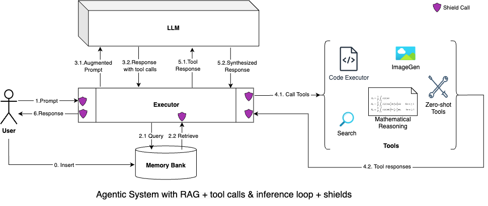

## Agentic API 101

This document talks about the Agentic APIs in Llama Stack.

Starting Llama 3.1 you can build agentic applications capable of:

- breaking a task down and performing multi-step reasoning.
- using tools to perform some actions
  - built-in: the model has built-in knowledge of tools like search or code interpreter
  - zero-shot: the model can learn to call tools using previously unseen, in-context tool definitions
- providing system level safety protections using models like Llama Guard.

An agentic app requires a few components:
- ability to run inference on the underlying Llama series of models
- ability to run safety checks using the Llama Guard series of models
- ability to execute tools, including a code execution environment, and loop using the model's multi-step reasoning process

All of these components are now offered by a single Llama Stack Distribution. Llama Stack defines and standardizes these components and many others that are needed to make building Generative AI applications smoother. Various implementations of these APIs are then assembled together via a **Llama Stack Distribution**.

### Run Agent example

To run an agent app, check out examples demo scripts with client SDKs to talk with the Llama Stack server in our llama-stack-apps repo. With the server running, to run a simple agent app:

```bash
git clone git@github.com:meta-llama/llama-stack-apps.git
cd llama-stack-apps
pip install -r requirements.txt
export BRAVE_SEARCH_API_KEY="DUMMY"
python -m examples.agents.client <host> <port>
```

You will see outputs like this:

```bash
Created session_id=bd6f0d9a-f7b5-49ab-bc34-7ad0989f1d5a for Agent(ba657ae6-ae9d-4693-bcd3-d5e7f2cb27b8)
inference> Switzerland is a beautiful country with a rich history, culture, and breathtaking natural scenery. Here are three top places to visit in Switzerland:

1. **Jungfraujoch**: Also known as the "Top of Europe," Jungfraujoch is a mountain peak located in the Bernese Alps. It's the highest train station in Europe, situated at an altitude of 3,454 meters (11,332 feet). From the top, you can enjoy breathtaking views of the surrounding mountains, glaciers, and valleys. You can also visit the Ice Palace, a stunning ice sculpture exhibit, and the Sphinx Observatory, which offers panoramic views of the Alps.
2. **Lake Geneva (Lac Léman)**: Located in the southwestern part of Switzerland, Lake Geneva is a stunning lake that shares borders with Switzerland, France, and Italy. The lake is surrounded by picturesque towns, vineyards, and rolling hills. You can take a boat tour of the lake, visit the Château de Chillon, a medieval castle located on the lake's shore, or explore the charming towns of Montreux and Vevey.
3. **Interlaken**: Located in the heart of the Swiss Alps, Interlaken is a popular destination for outdoor enthusiasts. The town is situated between two picturesque lakes, Thun and Brienz, and offers a range of activities such as hiking, paragliding, canyoning, and skiing. You can also take a boat tour of the lakes, visit the Schilthorn mountain, which offers breathtaking views of the Eiger, Mönch, and Jungfrau mountains, or explore the charming old town of Interlaken.

These three places offer a great combination of natural beauty, culture, and adventure, and are a great starting point for your trip to Switzerland.
inference> Jungfraujoch, also known as the "Top of Europe," is a unique and special destination for several reasons:

1. **Highest Train Station in Europe**: Jungfraujoch is the highest train station in Europe, situated at an altitude of 3,454 meters (11,332 feet) above sea level. The train ride to the top is an adventure in itself, with breathtaking views of the surrounding mountains and glaciers.
2. **Breathtaking Views**: From the top of Jungfraujoch, you can enjoy panoramic views of the surrounding mountains, including the Eiger, Mönch, and Jungfrau peaks. On a clear day, you can see up to 200 km (124 miles) in every direction, taking in the stunning vistas of the Swiss Alps.
3. **Ice Palace**: Jungfraujoch is home to the Ice Palace, a stunning ice sculpture exhibit that features intricate ice carvings and sculptures. The palace is made entirely of ice and snow, and is a must-see attraction for anyone visiting the top of Europe.
4. **Sphinx Observatory**: The Sphinx Observatory, located at the summit of Jungfraujoch, offers breathtaking views of the surrounding mountains and valleys. The observatory is also home to a variety of scientific instruments, including a telescope that allows visitors to see the sun and stars up close.
5. **Snow and Ice**: Jungfraujoch is one of the few places in the world where you can experience snow and ice year-round. Even in the summer, the temperature at the top of Jungfraujoch is around 0°C (32°F), making it a unique destination for those who want to experience the thrill of snow and ice in the middle of summer.
6. **Historical Significance**: Jungfraujoch has a rich history, dating back to the early 20th century when it was first developed as a tourist destination. The railway to the top was built in the 1910s, and the Ice Palace was constructed in the 1930s. Today, Jungfraujoch is a popular destination for tourists and adventurers from around the world.

Overall, Jungfraujoch is a unique and special destination that offers a range of experiences and activities that are unlike anywhere else in the world.
inference> Considering you're already planning a trip to Switzerland, here are some neighboring countries that you might want to consider clubbing with your trip:

1. **Austria**: Austria is a short train ride or drive from Switzerland, and it's home to some of the most beautiful cities in Europe, including Vienna, Salzburg, and Innsbruck. You can visit the Schönbrunn Palace in Vienna, explore the historic center of Salzburg, or ski in the Austrian Alps.
2. **Germany**: Germany is another neighboring country that's easily accessible from Switzerland. You can visit the vibrant city of Munich, explore the fairytale-like Neuschwanstein Castle, or stroll along the picturesque canals of Dresden.
3. **France**: France is a bit further away from Switzerland, but it's still a great option to consider. You can visit the beautiful city of Paris, explore the medieval town of Annecy, or ski in the French Alps.
4. **Italy**: Italy is a bit further away from Switzerland, but it's still a great option to consider. You can visit the beautiful city of Milan, explore the ancient ruins of Rome, or stroll along the canals of Venice.
5. **Liechtenstein**: Liechtenstein is a small country nestled between Switzerland and Austria. It's a great destination for outdoor enthusiasts, with plenty of hiking and skiing opportunities. You can also visit the picturesque capital city of Vaduz.

These countries offer a range of cultural, historical, and natural attractions that are worth exploring. However, keep in mind that each country has its own unique characteristics, and you should research and plan carefully to make the most of your trip.

Some popular routes and itineraries to consider:

* Switzerland-Austria-Germany: A great combination for history buffs, with stops in Vienna, Salzburg, and Munich.
* Switzerland-France-Italy: A great combination for foodies and wine enthusiasts, with stops in Paris, Annecy, and Milan.
* Switzerland-Liechtenstein-Austria: A great combination for outdoor enthusiasts, with stops in Vaduz, Innsbruck, and the Austrian Alps.

Remember to research and plan carefully to make the most of your trip, and consider factors like transportation, accommodation, and budget when clubbing countries with your trip to Switzerland.
inference> The capital of France is Paris.
```


## Readme for llama-stack-app:


### Agentic System Concept



In addition to the model lifecycle, we considered the different components involved in an agentic system. Specifically around tool calling and shields. Since the model may decide to call tools, a single model inference call is not enough. What’s needed is an agentic loop consisting of tool calls and inference. The model provides separate tokens representing end-of-message and end-of-turn. A message represents a possible stopping point for execution where the model can inform the execution environment that a tool call needs to be made. The execution environment, upon execution, adds back the result to the context window and makes another inference call. This process can get repeated until an end-of-turn token is generated.
Note that as of today, in the OSS world, such a “loop” is often coded explicitly via elaborate prompt engineering using a ReAct pattern (typically) or preconstructed execution graph. Llama 3.1 (and future Llamas) attempts to absorb this multi-step reasoning loop inside the main model itself.

**Let's consider an example:**
1. The user asks the system "Who played the NBA finals last year?"
2. The model "understands" that this question needs to be answered using web search. It answers this abstractly with a message of the form "Please call the search tool for me with the query: 'List finalist teams for NBA in the last year' ". Note that the model by itself does not call the tool (of course!)
3. The executor consults the set of tool implementations which have been configured by the developer to find an implementation for the "search tool". If it does not find it, it returns an error to the model. Otherwise, it executes this tool and returns the result of this tool back to the model.
4. The model reasons once again (using all the messages above) and decides to send a final response "In 2023, Denver Nuggets played against the Miami Heat in the NBA finals." to the executor
6. The executor returns the response directly to the user (since there is no tool call to be executed.)

The sequence diagram that details the steps is [here](https://github.com/meta-llama/llama-agentic-system/blob/main/docs/sequence-diagram.md).

* /memory_banks - to support creating multiple repositories of data that can be available for agentic systems
* /agentic_system - to support creating and running agentic systems. The sub-APIs support the creation and management of the steps, turns, and sessions within agentic applications.
  * /step - there can be inference, memory retrieval, tool call, or shield call steps
  * /turn - each turn begins with a user message and results in a loop consisting of multiple steps, followed by a response back to the user
  * /session - each session consists of multiple turns that the model is reasoning over
  * /memory_bank - a memory bank allows for the agentic system to perform retrieval augmented generation


### How to build your own agent

Agents Protocol is defined in [agents.py](../llama_stack/apis/agents/agents.py). Your agent class must have the following functions:

**create_agent(agent_config)**:

**create_agent_turn(agent_id,session_id,messages)**:

**get_agents_turn(agent_id, session_id, turn_id)**:

**get_agents_step(agent_id, session_id, turn_id, step_id)**:

**create_agent_session(agent_id, session_id)**:

**get_agents_session(agent_id, session_id, turn_id)**:

**delete_agents_session(agent_id, session_id)**:

**delete_agents(agent_id, session_id)**:
