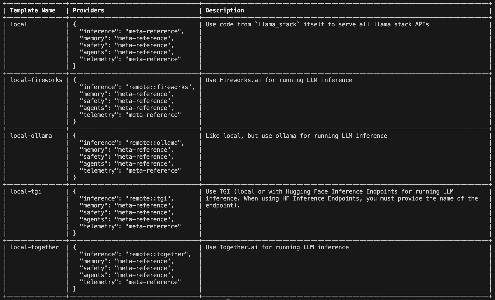

# Llama CLI Reference

The `llama` CLI tool helps you setup and use the Llama Stack & agentic systems. It should be available on your path after installing the `llama-stack` package.

### Subcommands
1. `download`: `llama` cli tools supports downloading the model from Meta or Hugging Face.
2. `model`: Lists available models and their properties.
3. `stack`: Allows you to build and run a Llama Stack server. You can read more about this [here](cli_reference.md#step-3-building-and-configuring-llama-stack-distributions).

### Sample Usage

```
llama --help
```
<pre style="font-family: monospace;">
usage: llama [-h] {download,model,stack} ...

Welcome to the Llama CLI

options:
  -h, --help            show this help message and exit

subcommands:
  {download,model,stack}
</pre>

## Step 1. Get the models

You first need to have models downloaded locally.

To download any model you need the **Model Descriptor**.
This can be obtained by running the command
```
llama model list
```

You should see a table like this:

<pre style="font-family: monospace;">
+----------------------------------+------------------------------------------+----------------+
| Model Descriptor                 | Hugging Face Repo                        | Context Length |
+----------------------------------+------------------------------------------+----------------+
| Llama3.1-8B                      | meta-llama/Llama-3.1-8B                  | 128K           |
+----------------------------------+------------------------------------------+----------------+
| Llama3.1-70B                     | meta-llama/Llama-3.1-70B                 | 128K           |
+----------------------------------+------------------------------------------+----------------+
| Llama3.1-405B:bf16-mp8           | meta-llama/Llama-3.1-405B                | 128K           |
+----------------------------------+------------------------------------------+----------------+
| Llama3.1-405B                    | meta-llama/Llama-3.1-405B-FP8            | 128K           |
+----------------------------------+------------------------------------------+----------------+
| Llama3.1-405B:bf16-mp16          | meta-llama/Llama-3.1-405B                | 128K           |
+----------------------------------+------------------------------------------+----------------+
| Llama3.1-8B-Instruct             | meta-llama/Llama-3.1-8B-Instruct         | 128K           |
+----------------------------------+------------------------------------------+----------------+
| Llama3.1-70B-Instruct            | meta-llama/Llama-3.1-70B-Instruct        | 128K           |
+----------------------------------+------------------------------------------+----------------+
| Llama3.1-405B-Instruct:bf16-mp8  | meta-llama/Llama-3.1-405B-Instruct       | 128K           |
+----------------------------------+------------------------------------------+----------------+
| Llama3.1-405B-Instruct           | meta-llama/Llama-3.1-405B-Instruct-FP8   | 128K           |
+----------------------------------+------------------------------------------+----------------+
| Llama3.1-405B-Instruct:bf16-mp16 | meta-llama/Llama-3.1-405B-Instruct       | 128K           |
+----------------------------------+------------------------------------------+----------------+
| Llama3.2-1B                      | meta-llama/Llama-3.2-1B                  | 128K           |
+----------------------------------+------------------------------------------+----------------+
| Llama3.2-3B                      | meta-llama/Llama-3.2-3B                  | 128K           |
+----------------------------------+------------------------------------------+----------------+
| Llama3.2-11B-Vision              | meta-llama/Llama-3.2-11B-Vision          | 128K           |
+----------------------------------+------------------------------------------+----------------+
| Llama3.2-90B-Vision              | meta-llama/Llama-3.2-90B-Vision          | 128K           |
+----------------------------------+------------------------------------------+----------------+
| Llama3.2-1B-Instruct             | meta-llama/Llama-3.2-1B-Instruct         | 128K           |
+----------------------------------+------------------------------------------+----------------+
| Llama3.2-3B-Instruct             | meta-llama/Llama-3.2-3B-Instruct         | 128K           |
+----------------------------------+------------------------------------------+----------------+
| Llama3.2-11B-Vision-Instruct     | meta-llama/Llama-3.2-11B-Vision-Instruct | 128K           |
+----------------------------------+------------------------------------------+----------------+
| Llama3.2-90B-Vision-Instruct     | meta-llama/Llama-3.2-90B-Vision-Instruct | 128K           |
+----------------------------------+------------------------------------------+----------------+
| Llama-Guard-3-11B-Vision         | meta-llama/Llama-Guard-3-11B-Vision      | 128K           |
+----------------------------------+------------------------------------------+----------------+
| Llama-Guard-3-1B:int4-mp1        | meta-llama/Llama-Guard-3-1B-INT4         | 128K           |
+----------------------------------+------------------------------------------+----------------+
| Llama-Guard-3-1B                 | meta-llama/Llama-Guard-3-1B              | 128K           |
+----------------------------------+------------------------------------------+----------------+
| Llama-Guard-3-8B                 | meta-llama/Llama-Guard-3-8B              | 128K           |
+----------------------------------+------------------------------------------+----------------+
| Llama-Guard-3-8B:int8-mp1        | meta-llama/Llama-Guard-3-8B-INT8         | 128K           |
+----------------------------------+------------------------------------------+----------------+
| Prompt-Guard-86M                 | meta-llama/Prompt-Guard-86M              | 128K           |
+----------------------------------+------------------------------------------+----------------+
| Llama-Guard-2-8B                 | meta-llama/Llama-Guard-2-8B              | 4K             |
+----------------------------------+------------------------------------------+----------------+
</pre>

To download models, you can use the llama download command.

#### Downloading from [Meta](https://llama.meta.com/llama-downloads/)

Here is an example download command to get the 3B-Instruct/11B-Vision-Instruct model. You will need META_URL which can be obtained from [here](https://llama.meta.com/docs/getting_the_models/meta/)

Download the required checkpoints using the following commands:
```bash
# download the 8B model, this can be run on a single GPU
llama download --source meta --model-id Llama3.2-3B-Instruct --meta-url META_URL

# you can also get the 70B model, this will require 8 GPUs however
llama download --source meta --model-id Llama3.2-11B-Vision-Instruct --meta-url META_URL

# llama-agents have safety enabled by default. For this, you will need
# safety models -- Llama-Guard and Prompt-Guard
llama download --source meta --model-id Prompt-Guard-86M --meta-url META_URL
llama download --source meta --model-id Llama-Guard-3-1B --meta-url META_URL
```

#### Downloading from [Hugging Face](https://huggingface.co/meta-llama)

Essentially, the same commands above work, just replace `--source meta` with `--source huggingface`.

```bash
llama download --source huggingface --model-id  Llama3.1-8B-Instruct --hf-token <HF_TOKEN>

llama download --source huggingface --model-id Llama3.1-70B-Instruct --hf-token <HF_TOKEN>

llama download --source huggingface --model-id Llama-Guard-3-1B --ignore-patterns *original*
llama download --source huggingface --model-id Prompt-Guard-86M --ignore-patterns *original*
```

**Important:** Set your environment variable `HF_TOKEN` or pass in `--hf-token` to the command to validate your access. You can find your token at [https://huggingface.co/settings/tokens](https://huggingface.co/settings/tokens).

> **Tip:** Default for `llama download` is to run with `--ignore-patterns *.safetensors` since we use the `.pth` files in the `original` folder. For Llama Guard and Prompt Guard, however, we need safetensors. Hence, please run with `--ignore-patterns original` so that safetensors are downloaded and `.pth` files are ignored.

#### Downloading via Ollama

If you're already using ollama, we also have a supported Llama Stack distribution `local-ollama` and you can continue to use ollama for managing model downloads.

```
ollama pull llama3.1:8b-instruct-fp16
ollama pull llama3.1:70b-instruct-fp16
```

> [!NOTE]
> Only the above two models are currently supported by Ollama.


## Step 2: Understand the models
The `llama model` command helps you explore the model’s interface.

### 2.1 Subcommands
1. `download`: Download the model from different sources. (meta, huggingface)
2. `list`: Lists all the models available for download with hardware requirements to deploy the models.
3. `prompt-format`: Show llama model message formats.
4. `describe`: Describes all the properties of the model.

### 2.2 Sample Usage

`llama model <subcommand> <options>`

```
llama model --help
```
<pre style="font-family: monospace;">
usage: llama model [-h] {download,list,prompt-format,describe} ...

Work with llama models

options:
  -h, --help            show this help message and exit

model_subcommands:
  {download,list,prompt-format,describe}
</pre>

You can use the describe command to know more about a model:
```
llama model describe -m Llama3.2-3B-Instruct
```
### 2.3 Describe

<pre style="font-family: monospace;">
+-----------------------------+----------------------------------+
| Model                       | Llama3.2-3B-Instruct             |
+-----------------------------+----------------------------------+
| Hugging Face ID             | meta-llama/Llama-3.2-3B-Instruct |
+-----------------------------+----------------------------------+
| Description                 | Llama 3.2 3b instruct model      |
+-----------------------------+----------------------------------+
| Context Length              | 128K tokens                      |
+-----------------------------+----------------------------------+
| Weights format              | bf16                             |
+-----------------------------+----------------------------------+
| Model params.json           | {                                |
|                             |     "dim": 3072,                 |
|                             |     "n_layers": 28,              |
|                             |     "n_heads": 24,               |
|                             |     "n_kv_heads": 8,             |
|                             |     "vocab_size": 128256,        |
|                             |     "ffn_dim_multiplier": 1.0,   |
|                             |     "multiple_of": 256,          |
|                             |     "norm_eps": 1e-05,           |
|                             |     "rope_theta": 500000.0,      |
|                             |     "use_scaled_rope": true      |
|                             | }                                |
+-----------------------------+----------------------------------+
| Recommended sampling params | {                                |
|                             |     "strategy": "top_p",         |
|                             |     "temperature": 1.0,          |
|                             |     "top_p": 0.9,                |
|                             |     "top_k": 0                   |
|                             | }                                |
+-----------------------------+----------------------------------+
</pre>
### 2.4 Prompt Format
You can even run `llama model prompt-format` see all of the templates and their tokens:

```
llama model prompt-format -m Llama3.2-3B-Instruct
```


You will be shown a Markdown formatted description of the model interface and how prompts / messages are formatted for various scenarios.

**NOTE**: Outputs in terminal are color printed to show special tokens.


## Step 3: Building, and Configuring Llama Stack Distributions

- Please see our [Getting Started](getting_started.md) guide for more details on how to build and start a Llama Stack distribution.

### Step 3.1 Build
In the following steps, imagine we'll be working with a `Llama3.1-8B-Instruct` model. We will name our build `8b-instruct` to help us remember the config. We will start build our distribution (in the form of a Conda environment, or Docker image). In this step, we will specify:
- `name`: the name for our distribution (e.g. `8b-instruct`)
- `image_type`: our build image type (`conda | docker`)
- `distribution_spec`: our distribution specs for specifying API providers
  - `description`: a short description of the configurations for the distribution
  - `providers`: specifies the underlying implementation for serving each API endpoint
  - `image_type`: `conda` | `docker` to specify whether to build the distribution in the form of Docker image or Conda environment.


At the end of build command, we will generate `<name>-build.yaml` file storing the build configurations.

After this step is complete, a file named `<name>-build.yaml` will be generated and saved at the output file path specified at the end of the command.

#### Building from scratch
- For a new user, we could start off with running `llama stack build` which will allow you to a interactively enter wizard where you will be prompted to enter build configurations.
```
llama stack build
```

Running the command above will allow you to fill in the configuration to build your Llama Stack distribution, you will see the following outputs.

```
> Enter an unique name for identifying your Llama Stack build distribution (e.g. my-local-stack): my-local-llama-stack
> Enter the image type you want your distribution to be built with (docker or conda): conda

 Llama Stack is composed of several APIs working together. Let's configure the providers (implementations) you want to use for these APIs.
> Enter the API provider for the inference API: (default=meta-reference): meta-reference
> Enter the API provider for the safety API: (default=meta-reference): meta-reference
> Enter the API provider for the agents API: (default=meta-reference): meta-reference
> Enter the API provider for the memory API: (default=meta-reference): meta-reference
> Enter the API provider for the telemetry API: (default=meta-reference): meta-reference

 > (Optional) Enter a short description for your Llama Stack distribution:

Build spec configuration saved at ~/.conda/envs/llamastack-my-local-llama-stack/my-local-llama-stack-build.yaml
```

#### Building from templates
- To build from alternative API providers, we provide distribution templates for users to get started building a distribution backed by different providers.

The following command will allow you to see the available templates and their corresponding providers.
```
llama stack build --list-templates
```



You may then pick a template to build your distribution with providers fitted to your liking.

```
llama stack build --template local-tgi --name my-tgi-stack
```

```
$ llama stack build --template local-tgi --name my-tgi-stack
...
...
Build spec configuration saved at ~/.conda/envs/llamastack-my-tgi-stack/my-tgi-stack-build.yaml
You may now run `llama stack configure my-tgi-stack` or `llama stack configure ~/.conda/envs/llamastack-my-tgi-stack/my-tgi-stack-build.yaml`
```

#### Building from config file
- In addition to templates, you may customize the build to your liking through editing config files and build from config files with the following command.

- The config file will be of contents like the ones in `llama_stack/distributions/templates/`.

```
$ cat llama_stack/distribution/templates/local-ollama-build.yaml

name: local-ollama
distribution_spec:
  description: Like local, but use ollama for running LLM inference
  providers:
    inference: remote::ollama
    memory: meta-reference
    safety: meta-reference
    agents: meta-reference
    telemetry: meta-reference
image_type: conda
```

```
llama stack build --config llama_stack/distribution/templates/local-ollama-build.yaml
```

#### How to build distribution with Docker image

To build a docker image, you may start off from a template and use the `--image-type docker` flag to specify `docker` as the build image type.

```
llama stack build --template local --image-type docker --name docker-0
```

Alternatively, you may use a config file and set `image_type` to `docker` in our `<name>-build.yaml` file, and run `llama stack build <name>-build.yaml`. The `<name>-build.yaml` will be of contents like:

```
name: local-docker-example
distribution_spec:
  description: Use code from `llama_stack` itself to serve all llama stack APIs
  docker_image: null
  providers:
    inference: meta-reference
    memory: meta-reference-faiss
    safety: meta-reference
    agentic_system: meta-reference
    telemetry: console
image_type: docker
```

The following command allows you to build a Docker image with the name `<name>`
```
llama stack build --config <name>-build.yaml

Dockerfile created successfully in /tmp/tmp.I0ifS2c46A/DockerfileFROM python:3.10-slim
WORKDIR /app
...
...
You can run it with: podman run -p 8000:8000 llamastack-docker-local
Build spec configuration saved at ~/.llama/distributions/docker/docker-local-build.yaml
```


### Step 3.2 Configure
After our distribution is built (either in form of docker or conda environment), we will run the following command to
```
llama stack configure [ <name> | <docker-image-name> | <path/to/name.build.yaml>]
```
- For `conda` environments: <path/to/name.build.yaml> would be the generated build spec saved from Step 1.
- For `docker` images downloaded from Dockerhub, you could also use <docker-image-name> as the argument.
   - Run `docker images` to check list of available images on your machine.

```
$ llama stack configure ~/.llama/distributions/conda/8b-instruct-build.yaml

Configuring API: inference (meta-reference)
Enter value for model (existing: Llama3.1-8B-Instruct) (required):
Enter value for quantization (optional):
Enter value for torch_seed (optional):
Enter value for max_seq_len (existing: 4096) (required):
Enter value for max_batch_size (existing: 1) (required):

Configuring API: memory (meta-reference-faiss)

Configuring API: safety (meta-reference)
Do you want to configure llama_guard_shield? (y/n): y
Entering sub-configuration for llama_guard_shield:
Enter value for model (default: Llama-Guard-3-1B) (required):
Enter value for excluded_categories (default: []) (required):
Enter value for disable_input_check (default: False) (required):
Enter value for disable_output_check (default: False) (required):
Do you want to configure prompt_guard_shield? (y/n): y
Entering sub-configuration for prompt_guard_shield:
Enter value for model (default: Prompt-Guard-86M) (required):

Configuring API: agentic_system (meta-reference)
Enter value for brave_search_api_key (optional):
Enter value for bing_search_api_key (optional):
Enter value for wolfram_api_key (optional):

Configuring API: telemetry (console)

YAML configuration has been written to ~/.llama/builds/conda/8b-instruct-run.yaml
```

After this step is successful, you should be able to find a run configuration spec in `~/.llama/builds/conda/8b-instruct-run.yaml` with the following contents. You may edit this file to change the settings.

As you can see, we did basic configuration above and configured:
- inference to run on model `Llama3.1-8B-Instruct` (obtained from `llama model list`)
- Llama Guard safety shield with model `Llama-Guard-3-1B`
- Prompt Guard safety shield with model `Prompt-Guard-86M`

For how these configurations are stored as yaml, checkout the file printed at the end of the configuration.

Note that all configurations as well as models are stored in `~/.llama`


### Step 3.3 Run
Now, let's start the Llama Stack Distribution Server. You will need the YAML configuration file which was written out at the end by the `llama stack configure` step.

```
llama stack run ~/.llama/builds/conda/8b-instruct-run.yaml
```

You should see the Llama Stack server start and print the APIs that it is supporting

```
$ llama stack run ~/.llama/builds/local/conda/8b-instruct.yaml

> initializing model parallel with size 1
> initializing ddp with size 1
> initializing pipeline with size 1
Loaded in 19.28 seconds
NCCL version 2.20.5+cuda12.4
Finished model load YES READY
Serving POST /inference/batch_chat_completion
Serving POST /inference/batch_completion
Serving POST /inference/chat_completion
Serving POST /inference/completion
Serving POST /safety/run_shield
Serving POST /agentic_system/memory_bank/attach
Serving POST /agentic_system/create
Serving POST /agentic_system/session/create
Serving POST /agentic_system/turn/create
Serving POST /agentic_system/delete
Serving POST /agentic_system/session/delete
Serving POST /agentic_system/memory_bank/detach
Serving POST /agentic_system/session/get
Serving POST /agentic_system/step/get
Serving POST /agentic_system/turn/get
Listening on :::5000
INFO:     Started server process [453333]
INFO:     Waiting for application startup.
INFO:     Application startup complete.
INFO:     Uvicorn running on http://[::]:5000 (Press CTRL+C to quit)
```

> [!NOTE]
> Configuration is in `~/.llama/builds/local/conda/8b-instruct-run.yaml`. Feel free to increase `max_seq_len`.

> [!IMPORTANT]
> The "local" distribution inference server currently only supports CUDA. It will not work on Apple Silicon machines.

> [!TIP]
> You might need to use the flag `--disable-ipv6` to  Disable IPv6 support

This server is running a Llama model locally.

### Step 3.4 Test with Client
Once the server is setup, we can test it with a client to see the example outputs.
```
cd /path/to/llama-stack
conda activate <env>  # any environment containing the llama-stack pip package will work

python -m llama_stack.apis.inference.client localhost 5000
```

This will run the chat completion client and query the distribution’s /inference/chat_completion API.

Here is an example output:
```
User>hello world, write me a 2 sentence poem about the moon
Assistant> Here's a 2-sentence poem about the moon:

The moon glows softly in the midnight sky,
A beacon of wonder, as it passes by.
```

Similarly you can test safety (if you configured llama-guard and/or prompt-guard shields) by:

```
python -m llama_stack.apis.safety.client localhost 5000
```

You can find more example scripts with client SDKs to talk with the Llama Stack server in our [llama-stack-apps](https://github.com/meta-llama/llama-stack-apps/tree/main/examples) repo.
