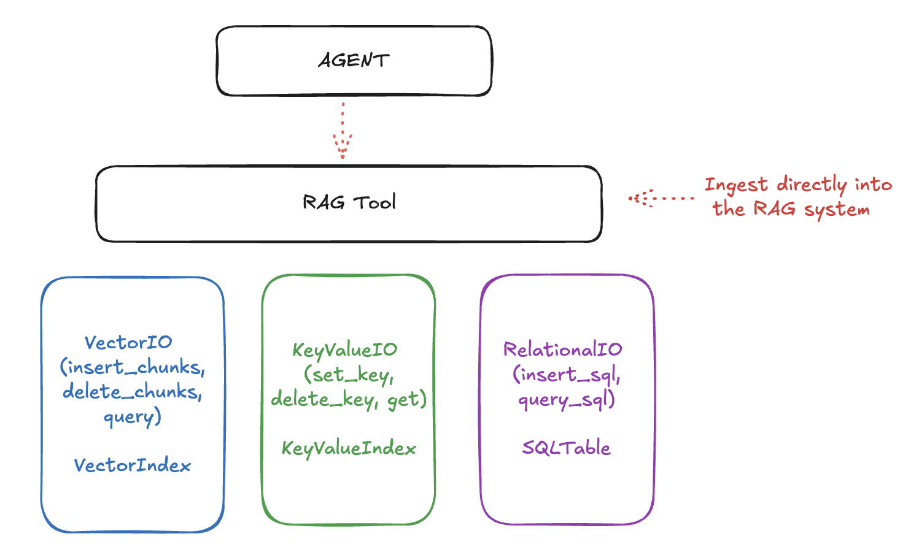

## Retrieval Augmented Generation (RAG)

RAG enables your applications to reference and recall information from previous interactions or external documents.

Llama Stack organizes the APIs that enable RAG into three layers:
1. The lowermost APIs deal with raw storage and retrieval. These include Vector IO, KeyValue IO (coming soon) and Relational IO (also coming soon.).
2. The next is the "Rag Tool", a first-class tool as part of the [Tools API](tools.md) that allows you to ingest documents (from URLs, files, etc) with various chunking strategies and query them smartly.
3. Finally, it all comes together with the top-level ["Agents" API](agent.md) that allows you to create agents that can use the tools to answer questions, perform tasks, and more.



The RAG system uses lower-level storage for different types of data:
* **Vector IO**: For semantic search and retrieval
* **Key-Value and Relational IO**: For structured data storage

We may add more storage types like Graph IO in the future.

### Setting up Vector DBs

For this guide, we will use [Ollama](https://ollama.com/) as the inference provider.
Ollama is an LLM runtime that allows you to run Llama models locally.

Here's how to set up a vector database for RAG:

```python
# Create http client
import os
from llama_stack_client import LlamaStackClient

client = LlamaStackClient(base_url=f"http://localhost:{os.environ['LLAMA_STACK_PORT']}")


# Register a vector db
vector_db_id = "my_documents"
response = client.vector_dbs.register(
    vector_db_id=vector_db_id,
    embedding_model="all-MiniLM-L6-v2",
    embedding_dimension=384,
    provider_id="faiss",
)
```

### Ingesting Documents
You can ingest documents into the vector database using two methods: directly inserting pre-chunked
documents or using the RAG Tool.
```python
# You can insert a pre-chunked document directly into the vector db
chunks = [
    {
        "content": "Your document text here",
        "mime_type": "text/plain",
        "metadata": {
            "document_id": "doc1",
            "author": "Jane Doe",
        },
    },
]
client.vector_io.insert(vector_db_id=vector_db_id, chunks=chunks)
```

#### Using Precomputed Embeddings
If you decide to precompute embeddings for your documents, you can insert them directly into the vector database by
including the embedding vectors in the chunk data. This is useful if you have a separate embedding service or if you
want to customize the ingestion process.
```python
chunks_with_embeddings = [
    {
        "content": "First chunk of text",
        "mime_type": "text/plain",
        "embedding": [0.1, 0.2, 0.3, ...],  # Your precomputed embedding vector
        "metadata": {"document_id": "doc1", "section": "introduction"},
    },
    {
        "content": "Second chunk of text",
        "mime_type": "text/plain",
        "embedding": [0.2, 0.3, 0.4, ...],  # Your precomputed embedding vector
        "metadata": {"document_id": "doc1", "section": "methodology"},
    },
]
client.vector_io.insert(vector_db_id=vector_db_id, chunks=chunks_with_embeddings)
```
When providing precomputed embeddings, ensure the embedding dimension matches the embedding_dimension specified when
registering the vector database.

### Retrieval
You can query the vector database to retrieve documents based on their embeddings.
```python
# You can then query for these chunks
chunks_response = client.vector_io.query(
    vector_db_id=vector_db_id, query="What do you know about..."
)
```

### Using the RAG Tool

A better way to ingest documents is to use the RAG Tool. This tool allows you to ingest documents from URLs, files, etc.
and automatically chunks them into smaller pieces. More examples for how to format a RAGDocument can be found in the
[appendix](#more-ragdocument-examples).

```python
from llama_stack_client import RAGDocument

urls = ["memory_optimizations.rst", "chat.rst", "llama3.rst"]
documents = [
    RAGDocument(
        document_id=f"num-{i}",
        content=f"https://raw.githubusercontent.com/pytorch/torchtune/main/docs/source/tutorials/{url}",
        mime_type="text/plain",
        metadata={},
    )
    for i, url in enumerate(urls)
]

client.tool_runtime.rag_tool.insert(
    documents=documents,
    vector_db_id=vector_db_id,
    chunk_size_in_tokens=512,
)

# Query documents
results = client.tool_runtime.rag_tool.query(
    vector_db_ids=[vector_db_id],
    content="What do you know about...",
)
```

You can configure how the RAG tool adds metadata to the context if you find it useful for your application. Simply add:
```python
# Query documents
results = client.tool_runtime.rag_tool.query(
    vector_db_ids=[vector_db_id],
    content="What do you know about...",
    query_config={
        "chunk_template": "Result {index}\nContent: {chunk.content}\nMetadata: {metadata}\n",
    },
)
```
### Building RAG-Enhanced Agents

One of the most powerful patterns is combining agents with RAG capabilities. Here's a complete example:

```python
from llama_stack_client import Agent

# Create agent with memory
agent = Agent(
    client,
    model="meta-llama/Llama-3.3-70B-Instruct",
    instructions="You are a helpful assistant",
    tools=[
        {
            "name": "builtin::rag/knowledge_search",
            "args": {
                "vector_db_ids": [vector_db_id],
                # Defaults
                "query_config": {
                    "chunk_size_in_tokens": 512,
                    "chunk_overlap_in_tokens": 0,
                    "chunk_template": "Result {index}\nContent: {chunk.content}\nMetadata: {metadata}\n",
                },
            },
        }
    ],
)
session_id = agent.create_session("rag_session")


# Ask questions about documents in the vector db, and the agent will query the db to answer the question.
response = agent.create_turn(
    messages=[{"role": "user", "content": "How to optimize memory in PyTorch?"}],
    session_id=session_id,
)
```

> **NOTE:** the `instructions` field in the `AgentConfig` can be used to guide the agent's behavior. It is important to experiment with different instructions to see what works best for your use case.


You can also pass documents along with the user's message and ask questions about them.
```python
# Initial document ingestion
response = agent.create_turn(
    messages=[
        {"role": "user", "content": "I am providing some documents for reference."}
    ],
    documents=[
        {
            "content": "https://raw.githubusercontent.com/pytorch/torchtune/main/docs/source/tutorials/memory_optimizations.rst",
            "mime_type": "text/plain",
        }
    ],
    session_id=session_id,
)

# Query with RAG
response = agent.create_turn(
    messages=[{"role": "user", "content": "What are the key topics in the documents?"}],
    session_id=session_id,
)
```

You can print the response with below.
```python
from llama_stack_client import AgentEventLogger

for log in AgentEventLogger().log(response):
    log.print()
```

### Unregistering Vector DBs

If you need to clean up and unregister vector databases, you can do so as follows:

```python
# Unregister a specified vector database
vector_db_id = "my_vector_db_id"
print(f"Unregistering vector database: {vector_db_id}")
client.vector_dbs.unregister(vector_db_id=vector_db_id)


# Unregister all vector databases
for vector_db_id in client.vector_dbs.list():
    print(f"Unregistering vector database: {vector_db_id.identifier}")
    client.vector_dbs.unregister(vector_db_id=vector_db_id.identifier)
```

### Appendix

#### More RAGDocument Examples
```python
from llama_stack_client import RAGDocument
import base64

RAGDocument(document_id="num-0", content={"uri": "file://path/to/file"})
RAGDocument(document_id="num-1", content="plain text")
RAGDocument(
    document_id="num-2",
    content={
        "type": "text",
        "text": "plain text input",
    },  # for inputs that should be treated as text explicitly
)
RAGDocument(
    document_id="num-3",
    content={
        "type": "image",
        "image": {"url": {"uri": "https://mywebsite.com/image.jpg"}},
    },
)
B64_ENCODED_IMAGE = base64.b64encode(
    requests.get(
        "https://raw.githubusercontent.com/meta-llama/llama-stack/refs/heads/main/docs/_static/llama-stack.png"
    ).content
)
RAGDocuemnt(
    document_id="num-4",
    content={"type": "image", "image": {"data": B64_ENCODED_IMAGE}},
)
```
for more strongly typed interaction use the typed dicts found [here](https://github.com/meta-llama/llama-stack-client-python/blob/38cd91c9e396f2be0bec1ee96a19771582ba6f17/src/llama_stack_client/types/shared_params/document.py).
