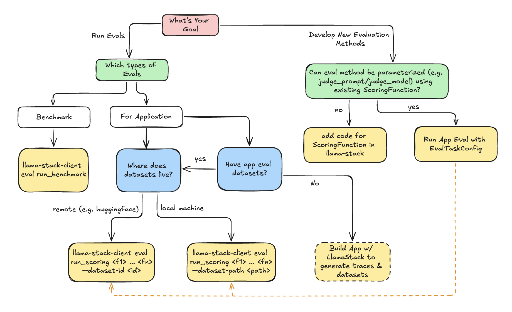

# Evaluations

The Llama Stack Evaluation flow allows you to run evaluations on your GenAI application datasets or pre-registered benchmarks.


We introduce a new set of APIs in Llama Stack for supporting running evaluations of LLM applications.
- `/datasetio` + `/datasets` API
- `/scoring` + `/scoring_functions` API
- `/eval` + `/eval_tasks` API

This guide goes over the sets of APIs and developer experience flow of using Llama Stack to run evaluations for different use cases.

## Evaluation Concepts

The Evaluation APIs are associated with a set of Resources as shown in the following diagram. Please visit the Resources section in our [Core Concepts](../concepts/index.md) guide for better high-level understanding.


- **DatasetIO**: defines interface with datasets and data loaders.
  - Associated with `Dataset` resource.
- **Scoring**: evaluate outputs of the system.
  - Associated with `ScoringFunction` resource. We provide a suite of out-of-the box scoring functions and also the ability for you to add custom evaluators. These scoring functions are the core part of defining an evaluation task to output evaluation metrics.
- **Eval**: generate outputs (via Inference or Agents) and perform scoring.
  - Associated with `EvalTask` resource.


## Running Evaluations
Use the following decision tree to decide how to use LlamaStack Evaluation flow.



```{admonition} Note on Benchmark v.s. Application Evaluation
:class: tip
- **Benchmark Evaluation** is a well-defined eval-task consisting of `dataset` and `scoring_function`. The generation (inference or agent) will be done as part of evaluation.
- **Application Evaluation** assumes users already have app inputs & generated outputs. Evaluation will purely focus on scoring the generated outputs via scoring functions (e.g. LLM-as-judge).
```

The following examples give the quick steps to start running evaluations using the llama-stack-client CLI.

#### Benchmark Evaluation CLI
Usage: There are 2 inputs necessary for running a benchmark eval
- `eval-task-id`: the identifier associated with the eval task. Each `EvalTask` is parametrized by
  - `dataset_id`: the identifier associated with the dataset.
  - `List[scoring_function_id]`: list of scoring function identifiers.
- `eval-task-config`: specifies the configuration of the model / agent to evaluate on.


```
llama-stack-client eval run_benchmark <eval-task-id> \
--eval-task-config ~/eval_task_config.json \
--visualize
```


#### Application Evaluation CLI
Usage: For running application evals, you will already have available datasets in hand from your application. You will need to specify:
- `scoring-fn-id`: List of ScoringFunction identifiers you wish to use to run on your application.
- `Dataset` used for evaluation:
  - (1) `--dataset-path`: path to local file system containing datasets to run evaluation on
  - (2) `--dataset-id`: pre-registered dataset in Llama Stack
- (Optional) `--scoring-params-config`: optionally parameterize scoring functions with custom params (e.g. `judge_prompt`, `judge_model`, `parsing_regexes`).


```
llama-stack-client eval run_scoring <scoring_fn_id_1> <scoring_fn_id_2> ... <scoring_fn_id_n>
--dataset-path <path-to-local-dataset> \
--output-dir ./
```

#### Defining EvalTaskConfig
The `EvalTaskConfig` are user specified config to define:
1. `EvalCandidate` to run generation on:
   - `ModelCandidate`: The model will be used for generation through LlamaStack /inference API.
   - `AgentCandidate`: The agentic system specified by AgentConfig will be used for generation through LlamaStack  /agents API.
2. Optionally scoring function params to allow customization of scoring function behaviour. This is useful to parameterize generic scoring functions such as LLMAsJudge with custom `judge_model` / `judge_prompt`.


**Example Benchmark EvalTaskConfig**
```json
{
    "type": "benchmark",
    "eval_candidate": {
        "type": "model",
        "model": "Llama3.2-3B-Instruct",
        "sampling_params": {
            "strategy": "greedy",
            "temperature": 0,
            "top_p": 0.95,
            "top_k": 0,
            "max_tokens": 0,
            "repetition_penalty": 1.0
        }
    }
}
```

**Example Application EvalTaskConfig**
```json
{
    "type": "app",
    "eval_candidate": {
        "type": "model",
        "model": "Llama3.1-405B-Instruct",
        "sampling_params": {
            "strategy": "greedy",
            "temperature": 0,
            "top_p": 0.95,
            "top_k": 0,
            "max_tokens": 0,
            "repetition_penalty": 1.0
        }
    },
    "scoring_params": {
        "llm-as-judge::llm_as_judge_base": {
            "type": "llm_as_judge",
            "judge_model": "meta-llama/Llama-3.1-8B-Instruct",
            "prompt_template": "Your job is to look at a question, a gold target ........",
            "judge_score_regexes": [
                "(A|B|C)"
            ]
        }
    }
}
```
