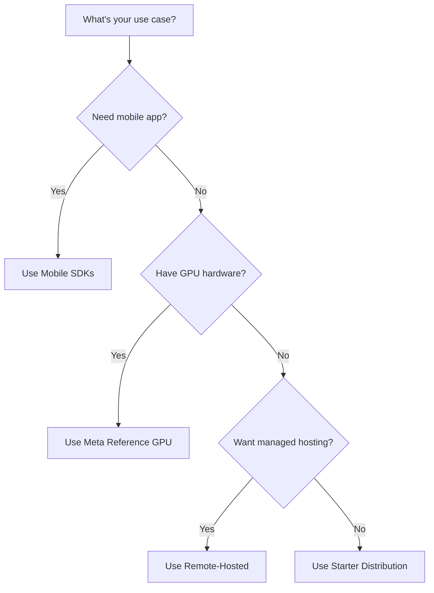

# Available Distributions

Llama Stack provides several pre-configured distributions to help you get started quickly. Choose the distribution that best fits your hardware and use case.

## Quick Reference

| Distribution | Use Case | Hardware Requirements | Provider |
|--------------|----------|----------------------|----------|
| `distribution-starter` | General purpose, prototyping | Any (CPU/GPU) | Ollama, Remote APIs |
| `distribution-meta-reference-gpu` | High-performance inference | GPU required | Local GPU inference |
| Remote-hosted | Production, managed service | None | Partner providers |
| iOS/Android SDK | Mobile applications | Mobile device | On-device inference |

## Choose Your Distribution

### 🚀 Getting Started (Recommended for Beginners)

**Use `distribution-starter` if you want to:**
- Prototype quickly without GPU requirements
- Use remote inference providers (Fireworks, Together, vLLM etc.)
- Run locally with Ollama for development

```bash
docker pull llama-stack/distribution-starter
```

**Guides:** [Starter Distribution Guide](self_hosted_distro/starter)

### 🖥️ Self-Hosted with GPU

**Use `distribution-meta-reference-gpu` if you:**
- Have access to GPU hardware
- Want maximum performance and control
- Need to run inference locally

```bash
docker pull llama-stack/distribution-meta-reference-gpu
```

**Guides:** [Meta Reference GPU Guide](self_hosted_distro/meta-reference-gpu)

### 🖥️ Self-Hosted with NVIDA NeMo Microservices

**Use `nvidia` if you:**
- Want to use Llama Stack with NVIDIA NeMo Microservices

**Guides:** [NVIDIA Distribution Guide](self_hosted_distro/nvidia)

### ☁️ Managed Hosting

**Use remote-hosted endpoints if you:**
- Don't want to manage infrastructure
- Need production-ready reliability
- Prefer managed services

**Partners:** [Fireworks.ai](https://fireworks.ai) and [Together.xyz](https://together.xyz)

**Guides:** [Remote-Hosted Endpoints](remote_hosted_distro/index)

### 📱 Mobile Development

**Use mobile SDKs if you:**
- Are building iOS or Android applications
- Need on-device inference capabilities
- Want offline functionality

- [iOS SDK](ondevice_distro/ios_sdk)
- [Android SDK](ondevice_distro/android_sdk)

### 🔧 Custom Solutions

**Build your own distribution if:**
- None of the above fit your specific needs
- You need custom configurations
- You want to optimize for your specific use case

**Guides:** [Building Custom Distributions](building_distro.md)

## Detailed Documentation

### Self-Hosted Distributions

```{toctree}
:maxdepth: 1

self_hosted_distro/starter
self_hosted_distro/meta-reference-gpu
```

### Remote-Hosted Solutions

```{toctree}
:maxdepth: 1

remote_hosted_distro/index
```

### Mobile SDKs

```{toctree}
:maxdepth: 1

ondevice_distro/ios_sdk
ondevice_distro/android_sdk
```

## Decision Flow



## Next Steps

1. **Choose your distribution** from the options above
2. **Follow the setup guide** for your selected distribution
3. **Configure your providers** with API keys or local models
4. **Start building** with Llama Stack!

For help choosing or troubleshooting, check our [Getting Started Guide](../getting_started/index.md) or [Community Support](https://github.com/llama-stack/llama-stack/discussions).
