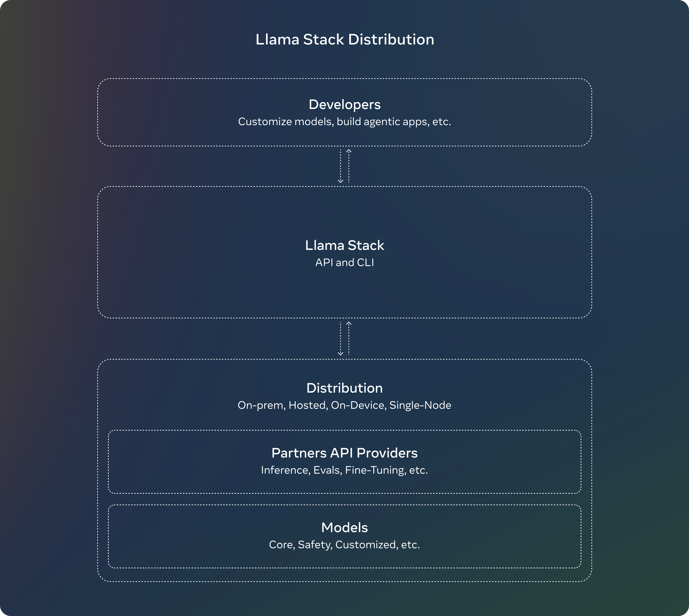

# llama-stack documentation

Llama Stack defines and standardizes the building blocks needed to bring generative AI applications to market. It empowers developers building agentic applications by giving them options to operate in various environments (on-prem, cloud, single-node, on-device) while relying on a standard API interface and the same DevEx that is certified by Meta.

The Llama Stack defines and standardizes the building blocks needed to bring generative AI applications to market. These blocks span the entire development lifecycle: from model training and fine-tuning, through product evaluation, to building and running AI agents in production. Beyond definition, we are building providers for the Llama Stack APIs. These were developing open-source versions and partnering with providers, ensuring developers can assemble AI solutions using consistent, interlocking pieces across platforms. The ultimate goal is to accelerate innovation in the AI space.

The Stack APIs are rapidly improving, but still very much work in progress and we invite feedback as well as direct contributions.



## APIs

The Llama Stack consists of the following set of APIs:

- Inference
- Safety
- Memory
- Agentic System
- Evaluation
- Post Training
- Synthetic Data Generation
- Reward Scoring
Each of the APIs themselves is a collection of REST endpoints.

## API Providers

A Provider is what makes the API real -- they provide the actual implementation backing the API.

As an example, for Inference, we could have the implementation be backed by open source libraries like [ torch | vLLM | TensorRT ] as possible options.

A provider can also be just a pointer to a remote REST service -- for example, cloud providers or dedicated inference providers could serve these APIs.

## Distribution

A Distribution is where APIs and Providers are assembled together to provide a consistent whole to the end application developer. You can mix-and-match providers -- some could be backed by local code and some could be remote. As a hobbyist, you can serve a small model locally, but can choose a cloud provider for a large model. Regardless, the higher level APIs your app needs to work with don't need to change at all. You can even imagine moving across the server / mobile-device boundary as well always using the same uniform set of APIs for developing Generative AI applications.

```{toctree}
cli_reference.md
getting_started.md
```
