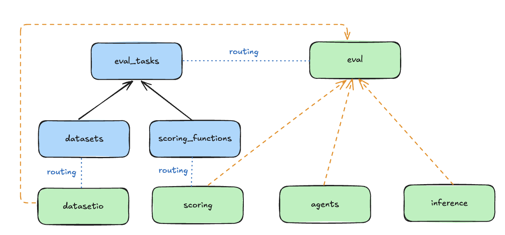

# Evaluations

The Llama Stack Evaluation flow allows you to run evaluations on your GenAI application datasets or pre-registered benchmarks.

We introduce a set of APIs in Llama Stack for supporting running evaluations of LLM applications.
- `/datasetio` + `/datasets` API
- `/scoring` + `/scoring_functions` API
- `/eval` + `/benchmarks` API

This guide goes over the sets of APIs and developer experience flow of using Llama Stack to run evaluations for different use cases. Checkout our Colab notebook on working examples with evaluations [here](https://colab.research.google.com/drive/10CHyykee9j2OigaIcRv47BKG9mrNm0tJ?usp=sharing).


## Evaluation Concepts

The Evaluation APIs are associated with a set of Resources as shown in the following diagram. Please visit the Resources section in our [Core Concepts](../../concepts/index.md) guide for better high-level understanding.



- **DatasetIO**: defines interface with datasets and data loaders.
  - Associated with `Dataset` resource.
- **Scoring**: evaluate outputs of the system.
  - Associated with `ScoringFunction` resource. We provide a suite of out-of-the box scoring functions and also the ability for you to add custom evaluators. These scoring functions are the core part of defining an evaluation task to output evaluation metrics.
- **Eval**: generate outputs (via Inference or Agents) and perform scoring.
  - Associated with `Benchmark` resource.


## Evaluation Examples Walkthrough

[](https://colab.research.google.com/github/meta-llama/llama-stack/blob/main/docs/notebooks/Llama_Stack_Benchmark_Evals.ipynb)

It is best to open this notebook in Colab to follow along with the examples.

### 1. Open Benchmark Model Evaluation

This first example walks you through how to evaluate a model candidate served by Llama Stack on open benchmarks. We will use the following benchmark:
- [MMMU](https://arxiv.org/abs/2311.16502) (A Massive Multi-discipline Multimodal Understanding and Reasoning Benchmark for Expert AGI)]: Benchmark designed to evaluate multimodal models.
- [SimpleQA](https://openai.com/index/introducing-simpleqa/): Benchmark designed to access models to answer short, fact-seeking questions.

#### 1.1 Running MMMU
- We will use a pre-processed MMMU dataset from [llamastack/mmmu](https://huggingface.co/datasets/llamastack/mmmu). The preprocessing code is shown in this [GitHub Gist](https://gist.github.com/yanxi0830/118e9c560227d27132a7fd10e2c92840). The dataset is obtained by transforming the original [MMMU/MMMU](https://huggingface.co/datasets/MMMU/MMMU) dataset into correct format by `inference/chat-completion` API.

```python
import datasets

ds = datasets.load_dataset(path="llamastack/mmmu", name="Agriculture", split="dev")
ds = ds.select_columns(["chat_completion_input", "input_query", "expected_answer"])
eval_rows = ds.to_pandas().to_dict(orient="records")
```

- Next, we will run evaluation on an model candidate, we will need to:
  - Define a system prompt
  - Define an EvalCandidate
  - Run evaluate on the dataset

```python
from rich.pretty import pprint
from tqdm import tqdm

SYSTEM_PROMPT_TEMPLATE = """
You are an expert in {subject} whose job is to answer questions from the user using images.

First, reason about the correct answer.

Then write the answer in the following format where X is exactly one of A,B,C,D:

Answer: X

Make sure X is one of A,B,C,D.

If you are uncertain of the correct answer, guess the most likely one.
"""

system_message = {
    "role": "system",
    "content": SYSTEM_PROMPT_TEMPLATE.format(subject=subset),
}

# register the evaluation benchmark task with the dataset and scoring function
client.benchmarks.register(
    benchmark_id="meta-reference::mmmu",
    dataset_id=f"mmmu-{subset}-{split}",
    scoring_functions=["basic::regex_parser_multiple_choice_answer"],
)

response = client.eval.evaluate_rows(
    benchmark_id="meta-reference::mmmu",
    input_rows=eval_rows,
    scoring_functions=["basic::regex_parser_multiple_choice_answer"],
    benchmark_config={
        "eval_candidate": {
            "type": "model",
            "model": "meta-llama/Llama-3.2-90B-Vision-Instruct",
            "sampling_params": {
                "strategy": {
                    "type": "top_p",
                    "temperature": 1.0,
                    "top_p": 0.95,
                },
                "max_tokens": 4096,
                "repeat_penalty": 1.0,
            },
            "system_message": system_message,
        },
    },
)
pprint(response)
```

#### 1.2. Running SimpleQA
- We will use a pre-processed SimpleQA dataset from [llamastack/evals](https://huggingface.co/datasets/llamastack/evals/viewer/evals__simpleqa) which is obtained by transforming the input query into correct format accepted by `inference/chat-completion` API.
- Since we will be using this same dataset in our next example for Agentic evaluation, we will register it using the `/datasets` API, and interact with it through `/datasetio` API.

```python
simpleqa_dataset_id = "huggingface::simpleqa"

_ = client.datasets.register(
    purpose="eval/messages-answer",
    source={
        "type": "uri",
        "uri": "huggingface://datasets/llamastack/simpleqa?split=train",
    },
    dataset_id=simpleqa_dataset_id,
)

eval_rows = client.datasets.iterrows(
    dataset_id=simpleqa_dataset_id,
    limit=5,
)
```

```python
client.benchmarks.register(
    benchmark_id="meta-reference::simpleqa",
    dataset_id=simpleqa_dataset_id,
    scoring_functions=["llm-as-judge::405b-simpleqa"],
)

response = client.eval.evaluate_rows(
    benchmark_id="meta-reference::simpleqa",
    input_rows=eval_rows.data,
    scoring_functions=["llm-as-judge::405b-simpleqa"],
    benchmark_config={
        "eval_candidate": {
            "type": "model",
            "model": "meta-llama/Llama-3.2-90B-Vision-Instruct",
            "sampling_params": {
                "strategy": {
                    "type": "greedy",
                },
                "max_tokens": 4096,
                "repeat_penalty": 1.0,
            },
        },
    },
)
pprint(response)
```


### 2. Agentic Evaluation
- In this example, we will demonstrate how to evaluate a agent candidate served by Llama Stack via `/agent` API.
- We will continue to use the SimpleQA dataset we used in previous example.
- Instead of running evaluation on model, we will run the evaluation on a Search Agent with access to search tool. We will define our agent evaluation candidate through `AgentConfig`.

```python
agent_config = {
    "model": "meta-llama/Llama-3.3-70B-Instruct",
    "instructions": "You are a helpful assistant that have access to tool to search the web. ",
    "sampling_params": {
        "strategy": {
            "type": "top_p",
            "temperature": 0.5,
            "top_p": 0.9,
        }
    },
    "toolgroups": [
        "builtin::websearch",
    ],
    "tool_choice": "auto",
    "tool_prompt_format": "json",
    "input_shields": [],
    "output_shields": [],
    "enable_session_persistence": False,
}

response = client.eval.evaluate_rows(
    benchmark_id="meta-reference::simpleqa",
    input_rows=eval_rows.data,
    scoring_functions=["llm-as-judge::405b-simpleqa"],
    benchmark_config={
        "eval_candidate": {
            "type": "agent",
            "config": agent_config,
        },
    },
)
pprint(response)
```

### 3. Agentic Application Dataset Scoring
[](https://colab.research.google.com/github/meta-llama/llama-stack/blob/main/docs/getting_started.ipynb)

Llama Stack offers a library of scoring functions and the `/scoring` API, allowing you to run evaluations on your pre-annotated AI application datasets.

In this example, we will work with an example RAG dataset you have built previously, label with an annotation, and use LLM-As-Judge with custom judge prompt for scoring. Please checkout our [Llama Stack Playground](../../building_applications/playground/index.md) for an interactive interface to upload datasets and run scorings.

```python
judge_model_id = "meta-llama/Llama-3.1-405B-Instruct-FP8"

JUDGE_PROMPT = """
Given a QUESTION and GENERATED_RESPONSE and EXPECTED_RESPONSE.

Compare the factual content of the GENERATED_RESPONSE with the EXPECTED_RESPONSE. Ignore any differences in style, grammar, or punctuation.
  The GENERATED_RESPONSE may either be a subset or superset of the EXPECTED_RESPONSE, or it may conflict with it. Determine which case applies. Answer the question by selecting one of the following options:
  (A) The GENERATED_RESPONSE is a subset of the EXPECTED_RESPONSE and is fully consistent with it.
  (B) The GENERATED_RESPONSE is a superset of the EXPECTED_RESPONSE and is fully consistent with it.
  (C) The GENERATED_RESPONSE contains all the same details as the EXPECTED_RESPONSE.
  (D) There is a disagreement between the GENERATED_RESPONSE and the EXPECTED_RESPONSE.
  (E) The answers differ, but these differences don't matter from the perspective of factuality.

Give your answer in the format "Answer: One of ABCDE, Explanation: ".

Your actual task:

QUESTION: {input_query}
GENERATED_RESPONSE: {generated_answer}
EXPECTED_RESPONSE: {expected_answer}
"""

input_query = (
    "What are the top 5 topics that were explained? Only list succinct bullet points."
)
generated_answer = """
Here are the top 5 topics that were explained in the documentation for Torchtune:

* What is LoRA and how does it work?
* Fine-tuning with LoRA: memory savings and parameter-efficient finetuning
* Running a LoRA finetune with Torchtune: overview and recipe
* Experimenting with different LoRA configurations: rank, alpha, and attention modules
* LoRA finetuning
"""
expected_answer = """LoRA"""

dataset_rows = [
    {
        "input_query": input_query,
        "generated_answer": generated_answer,
        "expected_answer": expected_answer,
    },
]

scoring_params = {
    "llm-as-judge::base": {
        "judge_model": judge_model_id,
        "prompt_template": JUDGE_PROMPT,
        "type": "llm_as_judge",
        "judge_score_regexes": ["Answer: (A|B|C|D|E)"],
    },
    "basic::subset_of": None,
    "braintrust::factuality": None,
}

response = client.scoring.score(
    input_rows=dataset_rows, scoring_functions=scoring_params
)
```

## Running Evaluations via CLI
The following examples give the quick steps to start running evaluations using the llama-stack-client CLI.

#### Benchmark Evaluation CLI
There are 3 necessary input for running a benchmark eval
- `list of benchmark_ids`: The list of benchmark ids to run evaluation on
- `model-id`: The model id to evaluate on
- `utput_dir`: Path to store the evaluate results
```
llama-stack-client eval run-benchmark <benchmark_id_1> <benchmark_id_2> ... \
--model_id <model id to evaluate on> \
--output_dir <directory to store the evaluate results> \
```

You can run
```
llama-stack-client eval run-benchmark help
```
to see the description of all the flags to run benckmark eval


In the output log, you can find the path to the file that has your evaluation results. Open that file and you can see you aggrgate
evaluation results over there.


#### Application Evaluation CLI
Usage: For running application evals, you will already have available datasets in hand from your application. You will need to specify:
- `scoring-fn-id`: List of ScoringFunction identifiers you wish to use to run on your application.
- `Dataset` used for evaluation:
  - (1) `--dataset-path`: path to local file system containing datasets to run evaluation on
  - (2) `--dataset-id`: pre-registered dataset in Llama Stack
- (Optional) `--scoring-params-config`: optionally parameterize scoring functions with custom params (e.g. `judge_prompt`, `judge_model`, `parsing_regexes`).


```
llama-stack-client eval run_scoring <scoring_fn_id_1> <scoring_fn_id_2> ... <scoring_fn_id_n>
--dataset-path <path-to-local-dataset> \
--output-dir ./
```

#### Defining BenchmarkConfig
The `BenchmarkConfig` are user specified config to define:
1. `EvalCandidate` to run generation on:
   - `ModelCandidate`: The model will be used for generation through LlamaStack /inference API.
   - `AgentCandidate`: The agentic system specified by AgentConfig will be used for generation through LlamaStack  /agents API.
2. Optionally scoring function params to allow customization of scoring function behaviour. This is useful to parameterize generic scoring functions such as LLMAsJudge with custom `judge_model` / `judge_prompt`.


**Example BenchmarkConfig**
```json
{
    "eval_candidate": {
        "type": "model",
        "model": "Llama3.1-405B-Instruct",
        "sampling_params": {
            "strategy": {
                "type": "greedy",
            },
            "max_tokens": 0,
            "repetition_penalty": 1.0
        }
    },
    "scoring_params": {
        "llm-as-judge::llm_as_judge_base": {
            "type": "llm_as_judge",
            "judge_model": "meta-llama/Llama-3.1-8B-Instruct",
            "prompt_template": "Your job is to look at a question, a gold target ........",
            "judge_score_regexes": [
                "(A|B|C)"
            ]
        }
    }
}
```


## Open-benchmark Contributing Guide

### Create the new dataset for your new benchmark
An eval open-benchmark essentially contains 2 parts:
- `raw data`: The raw dataset associated with the benchmark. You typically need to search the original paper that introduces the benchmark and find the canonical dataset (usually hosted on huggingface)
- `prompt template`: How to ask the candidate model to generate the answer (prompt template plays a critical role to the evaluation results). Tyically, you can find the reference prompt template associated with the benchmark in benchmarks author's repo ([exmaple](https://github.com/idavidrein/gpqa/blob/main/prompts/chain_of_thought.txt)) or some other popular open source repos ([example](https://github.com/openai/simple-evals/blob/0a6e8f62e52bc5ae915f752466be3af596caf392/common.py#L14))

To create new open-benmark in llama stack, you need to combine the prompt template and the raw data into the `chat_completion_input` column in the evaluation dataset.

Llama stack enforeces the evaluate dataset schema to contain at least 3 columns:
- `chat_completion_input`: The actual input to the model to run the generation for eval
- `input_query`: The raw input from the raw dataset without the prompt template
- `expected_answer`: The ground truth for scoring functions to calcalate the score from.


You need to write a script [example convert script](https://gist.github.com/yanxi0830/118e9c560227d27132a7fd10e2c92840) to convert the benchmark raw dataset to llama stack format eval dataset and update the dataset to huggingface [example benchmark dataset](https://huggingface.co/datasets/llamastack/mmmu)


### Find scoring function for your new benchmark
The purpose of scoring function is to calculate the score for each example based on candidate model generation result and expected_answer. It also aggregates the scores from all the examples and generate the final evaluate results.


Firstly, you can see if the existing [llama stack scoring functions](https://github.com/meta-llama/llama-stack/tree/main/llama_stack/providers/inline/scoring) can fulfill your need. If not, you need to write a new scoring function based on what benchmark author / other open source repo describe.

### Add new benchmark into template
Firstly, you need to add the evaluation dataset associated with your benchmark under `datasets` resource in the [open-benchmark](https://github.com/meta-llama/llama-stack/blob/main/llama_stack/distributions/open-benchmark/run.yaml)

Secondly, you need to add the new benchmark you just created under the `benchmarks` resource in the same template. To add the new benchmark, you need to have
- `benchmark_id`: identifier of the benchmark
- `dataset_id`: identifier of the dataset associated with your benchmark
- `scoring_functions`: scoring function to calculate the score based on generation results and expected_answer


### Test the new benchmark

Spin up llama stack server with 'open-benchmark' templates
```
llama stack run llama_stack/distributions/open-benchmark/run.yaml

```

Run eval benchmark CLI with your new benchmark id
```
llama-stack-client eval run-benchmark <new_benchmark_id> \
--model_id <model id to evaluate on> \
--output_dir <directory to store the evaluate results> \
```
