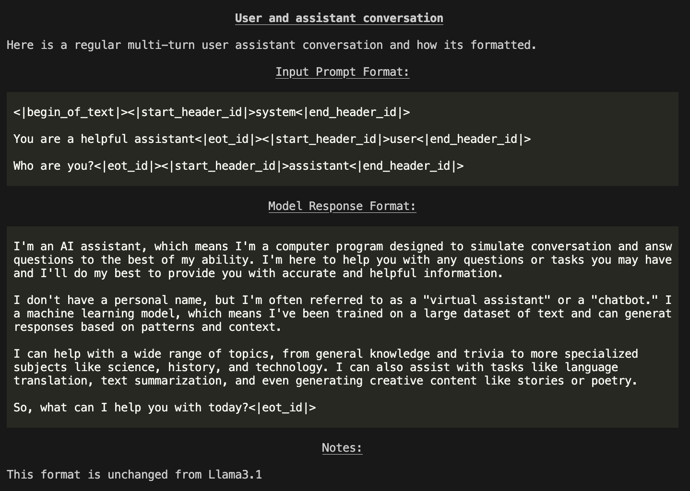

# llama (server-side) CLI Reference

The `llama` CLI tool helps you set up and use the Llama Stack. The CLI is available on your path after installing the `llama-stack` package.

## Installation

You have two ways to install Llama Stack:

1. **Install as a package**:
   You can install the repository directly from [PyPI](https://pypi.org/project/llama-stack/) by running the following command:
   ```bash
   pip install llama-stack
   ```

2. **Install from source**:
   If you prefer to install from the source code, follow these steps:
   ```bash
    mkdir -p ~/local
    cd ~/local
    git clone git@github.com:meta-llama/llama-stack.git

    python -m venv myenv
    source myenv/bin/activate  # On Windows: myenv\Scripts\activate

    cd llama-stack
    pip install -e .


## `llama` subcommands
1. `download`: Supports downloading models from Meta or Hugging Face.  [Downloading models](#downloading-models)
2. `model`: Lists available models and their properties. [Understanding models](#understand-the-models)
3. `stack`: Allows you to build a stack using the `llama stack` distribution and run a Llama Stack server. You can read more about how to build a Llama Stack distribution in the [Build your own Distribution](../../distributions/building_distro) documentation.

### Sample Usage

```
llama --help
```

```
usage: llama [-h] {download,model,stack} ...

Welcome to the Llama CLI

options:
  -h, --help            show this help message and exit

subcommands:
  {download,model,stack}
```

## Downloading models

You first need to have models downloaded locally.

To download any model you need the **Model Descriptor**.
This can be obtained by running the command
```
llama model list
```

You should see a table like this:

```
+----------------------------------+------------------------------------------+----------------+
| Model Descriptor(ID)             | Hugging Face Repo                        | Context Length |
+----------------------------------+------------------------------------------+----------------+
| Llama3.1-8B                      | meta-llama/Llama-3.1-8B                  | 128K           |
+----------------------------------+------------------------------------------+----------------+
| Llama3.1-70B                     | meta-llama/Llama-3.1-70B                 | 128K           |
+----------------------------------+------------------------------------------+----------------+
| Llama3.1-405B:bf16-mp8           | meta-llama/Llama-3.1-405B                | 128K           |
+----------------------------------+------------------------------------------+----------------+
| Llama3.1-405B                    | meta-llama/Llama-3.1-405B-FP8            | 128K           |
+----------------------------------+------------------------------------------+----------------+
| Llama3.1-405B:bf16-mp16          | meta-llama/Llama-3.1-405B                | 128K           |
+----------------------------------+------------------------------------------+----------------+
| Llama3.1-8B-Instruct             | meta-llama/Llama-3.1-8B-Instruct         | 128K           |
+----------------------------------+------------------------------------------+----------------+
| Llama3.1-70B-Instruct            | meta-llama/Llama-3.1-70B-Instruct        | 128K           |
+----------------------------------+------------------------------------------+----------------+
| Llama3.1-405B-Instruct:bf16-mp8  | meta-llama/Llama-3.1-405B-Instruct       | 128K           |
+----------------------------------+------------------------------------------+----------------+
| Llama3.1-405B-Instruct           | meta-llama/Llama-3.1-405B-Instruct-FP8   | 128K           |
+----------------------------------+------------------------------------------+----------------+
| Llama3.1-405B-Instruct:bf16-mp16 | meta-llama/Llama-3.1-405B-Instruct       | 128K           |
+----------------------------------+------------------------------------------+----------------+
| Llama3.2-1B                      | meta-llama/Llama-3.2-1B                  | 128K           |
+----------------------------------+------------------------------------------+----------------+
| Llama3.2-3B                      | meta-llama/Llama-3.2-3B                  | 128K           |
+----------------------------------+------------------------------------------+----------------+
| Llama3.2-11B-Vision              | meta-llama/Llama-3.2-11B-Vision          | 128K           |
+----------------------------------+------------------------------------------+----------------+
| Llama3.2-90B-Vision              | meta-llama/Llama-3.2-90B-Vision          | 128K           |
+----------------------------------+------------------------------------------+----------------+
| Llama3.2-1B-Instruct             | meta-llama/Llama-3.2-1B-Instruct         | 128K           |
+----------------------------------+------------------------------------------+----------------+
| Llama3.2-3B-Instruct             | meta-llama/Llama-3.2-3B-Instruct         | 128K           |
+----------------------------------+------------------------------------------+----------------+
| Llama3.2-11B-Vision-Instruct     | meta-llama/Llama-3.2-11B-Vision-Instruct | 128K           |
+----------------------------------+------------------------------------------+----------------+
| Llama3.2-90B-Vision-Instruct     | meta-llama/Llama-3.2-90B-Vision-Instruct | 128K           |
+----------------------------------+------------------------------------------+----------------+
| Llama-Guard-3-11B-Vision         | meta-llama/Llama-Guard-3-11B-Vision      | 128K           |
+----------------------------------+------------------------------------------+----------------+
| Llama-Guard-3-1B:int4-mp1        | meta-llama/Llama-Guard-3-1B-INT4         | 128K           |
+----------------------------------+------------------------------------------+----------------+
| Llama-Guard-3-1B                 | meta-llama/Llama-Guard-3-1B              | 128K           |
+----------------------------------+------------------------------------------+----------------+
| Llama-Guard-3-8B                 | meta-llama/Llama-Guard-3-8B              | 128K           |
+----------------------------------+------------------------------------------+----------------+
| Llama-Guard-3-8B:int8-mp1        | meta-llama/Llama-Guard-3-8B-INT8         | 128K           |
+----------------------------------+------------------------------------------+----------------+
| Prompt-Guard-86M                 | meta-llama/Prompt-Guard-86M              | 128K           |
+----------------------------------+------------------------------------------+----------------+
| Llama-Guard-2-8B                 | meta-llama/Llama-Guard-2-8B              | 4K             |
+----------------------------------+------------------------------------------+----------------+
```

To download models, you can use the `llama download` command.

### Downloading from [Meta](https://llama.meta.com/llama-downloads/)

Here is an example download command to get the 3B-Instruct/11B-Vision-Instruct model. You will need META_URL which can be obtained from [here](https://llama.meta.com/docs/getting_the_models/meta/)

Download the required checkpoints using the following commands:
```bash
# download the 8B model, this can be run on a single GPU
llama download --source meta --model-id Llama3.2-3B-Instruct --meta-url META_URL

# you can also get the 70B model, this will require 8 GPUs however
llama download --source meta --model-id Llama3.2-11B-Vision-Instruct --meta-url META_URL

# llama-agents have safety enabled by default. For this, you will need
# safety models -- Llama-Guard and Prompt-Guard
llama download --source meta --model-id Prompt-Guard-86M --meta-url META_URL
llama download --source meta --model-id Llama-Guard-3-1B --meta-url META_URL
```

### Downloading from [Hugging Face](https://huggingface.co/meta-llama)

Essentially, the same commands above work, just replace `--source meta` with `--source huggingface`.

```bash
llama download --source huggingface --model-id  Llama3.1-8B-Instruct --hf-token <HF_TOKEN>

llama download --source huggingface --model-id Llama3.1-70B-Instruct --hf-token <HF_TOKEN>

llama download --source huggingface --model-id Llama-Guard-3-1B --ignore-patterns *original*
llama download --source huggingface --model-id Prompt-Guard-86M --ignore-patterns *original*
```

**Important:** Set your environment variable `HF_TOKEN` or pass in `--hf-token` to the command to validate your access. You can find your token at [https://huggingface.co/settings/tokens](https://huggingface.co/settings/tokens).

> **Tip:** Default for `llama download` is to run with `--ignore-patterns *.safetensors` since we use the `.pth` files in the `original` folder. For Llama Guard and Prompt Guard, however, we need safetensors. Hence, please run with `--ignore-patterns original` so that safetensors are downloaded and `.pth` files are ignored.

## List the downloaded models

To list the downloaded models with the following command:
```
llama model list --downloaded
```

You should see a table like this:
```
┏━━━━━━━━━━━━━━━━━━━━━━━━━━━━━━━━━━━━━━━━━┳━━━━━━━━━━┳━━━━━━━━━━━━━━━━━━━━━┓
┃ Model                                   ┃ Size     ┃ Modified Time       ┃
┡━━━━━━━━━━━━━━━━━━━━━━━━━━━━━━━━━━━━━━━━━╇━━━━━━━━━━╇━━━━━━━━━━━━━━━━━━━━━┩
│ Llama3.2-1B-Instruct:int4-qlora-eo8     │ 1.53 GB  │ 2025-02-26 11:22:28 │
├─────────────────────────────────────────┼──────────┼─────────────────────┤
│ Llama3.2-1B                             │ 2.31 GB  │ 2025-02-18 21:48:52 │
├─────────────────────────────────────────┼──────────┼─────────────────────┤
│ Prompt-Guard-86M                        │ 0.02 GB  │ 2025-02-26 11:29:28 │
├─────────────────────────────────────────┼──────────┼─────────────────────┤
│ Llama3.2-3B-Instruct:int4-spinquant-eo8 │ 3.69 GB  │ 2025-02-26 11:37:41 │
├─────────────────────────────────────────┼──────────┼─────────────────────┤
│ Llama3.2-3B                             │ 5.99 GB  │ 2025-02-18 21:51:26 │
├─────────────────────────────────────────┼──────────┼─────────────────────┤
│ Llama3.1-8B                             │ 14.97 GB │ 2025-02-16 10:36:37 │
├─────────────────────────────────────────┼──────────┼─────────────────────┤
│ Llama3.2-1B-Instruct:int4-spinquant-eo8 │ 1.51 GB  │ 2025-02-26 11:35:02 │
├─────────────────────────────────────────┼──────────┼─────────────────────┤
│ Llama-Guard-3-1B                        │ 2.80 GB  │ 2025-02-26 11:20:46 │
├─────────────────────────────────────────┼──────────┼─────────────────────┤
│ Llama-Guard-3-1B:int4                   │ 0.43 GB  │ 2025-02-26 11:33:33 │
└─────────────────────────────────────────┴──────────┴─────────────────────┘
```


## Understand the models
The `llama model` command helps you explore the model’s interface.

1. `download`: Download the model from different sources. (meta, huggingface)
2. `list`: Lists all the models available for download with hardware requirements for deploying the models.
3. `prompt-format`: Show llama model message formats.
4. `describe`: Describes all the properties of the model.

### Sample Usage

`llama model <subcommand> <options>`

```
llama model --help
```
```
usage: llama model [-h] {download,list,prompt-format,describe,verify-download,remove} ...

Work with llama models

options:
  -h, --help            show this help message and exit

model_subcommands:
  {download,list,prompt-format,describe,verify-download,remove}
```

### Describe

You can use the describe command to know more about a model:
```
llama model describe -m Llama3.2-3B-Instruct
```
```
+-----------------------------+----------------------------------+
| Model                       | Llama3.2-3B-Instruct             |
+-----------------------------+----------------------------------+
| Hugging Face ID             | meta-llama/Llama-3.2-3B-Instruct |
+-----------------------------+----------------------------------+
| Description                 | Llama 3.2 3b instruct model      |
+-----------------------------+----------------------------------+
| Context Length              | 128K tokens                      |
+-----------------------------+----------------------------------+
| Weights format              | bf16                             |
+-----------------------------+----------------------------------+
| Model params.json           | {                                |
|                             |     "dim": 3072,                 |
|                             |     "n_layers": 28,              |
|                             |     "n_heads": 24,               |
|                             |     "n_kv_heads": 8,             |
|                             |     "vocab_size": 128256,        |
|                             |     "ffn_dim_multiplier": 1.0,   |
|                             |     "multiple_of": 256,          |
|                             |     "norm_eps": 1e-05,           |
|                             |     "rope_theta": 500000.0,      |
|                             |     "use_scaled_rope": true      |
|                             | }                                |
+-----------------------------+----------------------------------+
| Recommended sampling params | {                                |
|                             |     "temperature": 1.0,          |
|                             |     "top_p": 0.9,                |
|                             |     "top_k": 0                   |
|                             | }                                |
+-----------------------------+----------------------------------+
```

### Prompt Format
You can even run `llama model prompt-format` see all of the templates and their tokens:

```
llama model prompt-format -m Llama3.2-3B-Instruct
```



You will be shown a Markdown formatted description of the model interface and how prompts / messages are formatted for various scenarios.

**NOTE**: Outputs in terminal are color printed to show special tokens.

### Remove model
You can run `llama model remove` to remove an unnecessary model:

```
llama model remove -m Llama-Guard-3-8B-int8
```
