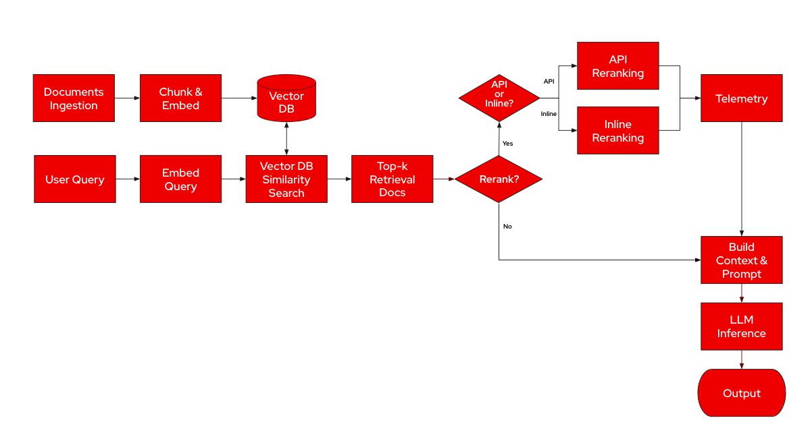

# RFC: Llama-Stack Reranking for RAG Workflows

**Status:** Draft  
**Author:** Kevin Cogan  
**Start Date:** 2025-02-24

## Table of Contents

1. [Abstract](#abstract)  
2. [Introduction](#introduction)  
3. [Problem Statement](#problem-statement)  
4. [Proposed Reranking Solution](#proposed-reranking-solution)  
   4.1. [Extended API Endpoints](#extended-api-endpoints)  
   &nbsp;&nbsp;&nbsp;&nbsp;4.1.1. [Enhanced Query Endpoint](#enhanced-query-endpoint)  
   &nbsp;&nbsp;&nbsp;&nbsp;4.1.2. [Dedicated Rerank Endpoint](#dedicated-rerank-endpoint)  
   4.2. [Data Models and Schemas](#data-models-and-schemas)  
   4.3. [Implementation in the RAG Runtime](#implementation-in-the-rag-runtime)  
   &nbsp;&nbsp;&nbsp;&nbsp;4.3.1. [Inline Reranking Integration](#inline-reranking-integration)  
   &nbsp;&nbsp;&nbsp;&nbsp;4.3.2. [Reranker Service](#reranker-service)  
   4.4. [Example Configuration and Request](#example-configuration-and-request)  
5. [API Design Overview](#api-design-overview)  
6. [Considerations and Tradeoffs](#considerations-and-tradeoffs)  
7. [Conclusion](#conclusion)  
8. [Approvals](#approvals)  


## Abstract
This RFC proposes an enhancement to the Llama-Stack Retrieval-Augmented Generation (RAG) system through a configurable reranking component. Many enterprise users rely on legacy keyword search systems that already have significant investments in content synchronization and indexing. In these cases, re-ranking can improve accuracy by refining search results without requiring a full transition to a vector-based retrieval system. By incorporating an additional scoring step—using either a remote inference API or a self-hosted model—the system enhances document retrieval, providing more precise context for downstream tasks. Users have the flexibility to enable or disable reranking and to select a reranker from remote providers (e.g., LlamaRank, Voyage AI, Cohere) or self-hosted models (e.g., sentence-transformers, LLM-based inference). Additionally, telemetry updates are integrated to capture and report reranking metrics for enhanced observability and performance tuning.
By incorporating an additional scoring step—using either a remote inference API or a self-hosted model—the system enhances document retrieval, providing more precise context for downstream tasks. Users have the flexibility to enable or disable reranking and to select a reranker from remote providers (e.g., LlamaRank, Voyage AI, Cohere) or self-hosted models (e.g., sentence-transformers, LLM-based inference). Additionally, telemetry updates are integrated to capture and report reranking metrics for enhanced observability and performance tuning.  

## Introduction
Current RAG implementations use embedding-based similarity search to retrieve document candidates; however, the preliminary ordering can be suboptimal for ambiguous or complex queries. For enterprise users who rely on keyword-based search systems, re-ranking can be especially impactful, as it enhances accuracy without requiring a full migration to vector search. This document outlines an approach that provides both API-based reranking and inline reranking, ensuring seamless integration with existing retrieval systems while emphasizing configurability, ease of implementation, and robust telemetry reporting.

## Problem Statement
Existing RAG systems efficiently index and retrieve document chunks from vector stores, but they often lack a mechanism to refine initial results. This can lead to suboptimal context for LLMs and hinder overall performance. The case for re-ranking is especially strong for enterprise users relying on legacy keyword search systems, where significant investments have already been made in content synchronization and indexing. In these environments, re-ranking can substantially improve accuracy by refining outputs from established search infrastructure. While new vector stores using state-of-the-art dense models also benefit from re-ranking, the improvements tend to be less pronounced and may not justify the additional complexity and latency. Moreover, different operational needs mean that some users prefer a managed API solution, while others require inline control for low latency or data privacy.

## Proposed Reranking Solution

## 4.1. Extended API Endpoints

### 4.1.1. Query Endpoint

The `/tool-runtime/rag-tool/query` endpoint will be updated to accept three additional parameters:

- `rerank` (boolean): Enables the reranking process when set to `true`.
- `reranker_model_id` (string): Specifies the reranking provider or model (e.g., `"sentence-transformers"` or self-hosted models).
- `rerank_config` (`Optional[RAGRerankConfig]`): Configures additional options for the reranking process (e.g. `is_external_reranker`, `api_url`, `api_key`).

The updated endpoint interface is as follows:

```python
@runtime_checkable
@trace_protocol
class RAGToolRuntime(Protocol):
    @webmethod(route="/tool-runtime/rag-tool/query", method="POST")
    async def query(
        self,
        content: InterleavedContent,
        vector_db_ids: List[str],
        query_config: Optional[RAGQueryConfig] = None,
        rerank: bool = False,
        reranker_model_id: str = "my_model_id",
        rerank_config: Optional[RAGRerankConfig] = None
    ) -> RAGQueryResult:
        ...
```
> <sub>**Note:** Note: When rerank is enabled, the service will invoke the reranking process using the specified reranker_model_id and additional options defined in rerank_config.

### 4.1.2. Dedicated Rerank Endpoint

A new endpoint, `/tool-runtime/rag-tool/rerank`, is introduced. It accepts the following parameters:

- **`query`** (*InterleavedContent*): The input search query.
- **`retrieved_docs`** (*List[RAGDocument]*): A list of retrieved documents.
- **`reranker_model_id`** (*string*): Identifier of the reranker model.
- **`top_k`** (*integer*): The number of top documents to return.
- **`rerank_config`** (*Optional[RAGRerankConfig]*): Configures additional options for the reranking process (e.g., `is_external_reranker`, `api_url`, `api_key`).

Below is an example implementation of the endpoint:

```python
@webmethod(route="/tool-runtime/rag-tool/rerank", method="POST")
async def rerank(
    self,
    query: InterleavedContent,
    top_k: int = 5,
    retrieved_docs: List[RAGDocument],
    reranker_model_id: str = "my_model_id",
    rerank_config: Optional[RAGRerankConfig] = None
) -> RerankResponse:
    """Re-rank retrieved documents based on relevance"""
    ...
```
## 4.2. Data Models and Schemas

The following Pydantic schemas define the data models that support the reranking process. They ensure that the input and output data structures conform to expected types and constraints.

- **RerankedDocument**:  
  Represents an individual document after the reranking operation. It includes the document's original index and a computed relevance score.

- **RerankResponse**:  
  Wraps the results from the reranking process. It includes a list of reranked documents along with optional metadata for any additional context.

- **RAGRerankConfig**:  
  Provides optional configuration settings for external services used during reranking.


Below is the updated schema definition:
```python
from pydantic import BaseModel, Field
from typing import List, Dict, Any, Optional

class RerankedDocument(BaseModel):
    """Represents a single document after reranking.
    
    Attributes:
        index (int): The original position of the document.
        relevance_score (float): The computed relevance score.
    """
    index: int
    relevance_score: float

class RerankResponse(BaseModel):
    """Defines the response structure for the rerank endpoint.
    
    Attributes:
        reranked_documents (List[RerankedDocument]): The list of
        documents sorted by relevance.
        metadata (Dict[str, Any]): Additional metadata related to the
        reranking process.
    """
    reranked_documents: List[RerankedDocument]
    metadata: Dict[str, Any] = Field(default_factory=dict)

@json_schema_type
class RAGRerankConfig(BaseModel):
    """Configuration settings for the reranking service.
    
    Attributes:
        is_external_reranker (bool): The type of provider. Defaults to False.
        api_url (Optional[str]): The API endpoint for the external
        service (if applicable).
        api_key (Optional[str]): The API key for authenticating with the
        external service.
    """
    is_external_reranker: bool = False
    api_url: Optional[str] = None
    api_key: Optional[str] = None
```

## 4.3. Implementation in the RAG Runtime

### 4.3.1. Inline Reranking Integration

Within the RAG runtime (e.g., in `/llama_stack/providers/inline/tool_runtime/rag/memory.py`), the `query` method is extended to support inline reranking. When the `rerank` flag is enabled, the system calls a dedicated reranking endpoint via the `RerankerService` to re-score the initially retrieved document chunks.

Below is an improved example of the integration:

```python
class MemoryToolRuntimeImpl(ToolsProtocolPrivate, ToolRuntime, RAGToolRuntime):
    async def query(
        self,
        content: InterleavedContent,
        vector_db_ids: List[str],
        query_config: Optional[RAGQueryConfig] = None,
        rerank: bool = False,
        reranker_model_id: str = "my_model_id",
        rerank_config: Optional[RAGRerankConfig] = None
    ) -> RAGQueryResult:
        # ... [initial retrieval logic that produces `chunks` and `scores`] ...

        if rerank:
            # Call RerankerService to obtain refined relevance scores.
            # Note: The reranker service uses the query, the retrieved
            # document chunks, and any additional config.
            reranked_results = await RerankerService.rerank_documents(
                query=content,
                documents=list(chunks),
                config=rerank_config
            )

            # Build a mapping from the original chunk index to its new
            # reranked score.
            index_to_score = {
                doc.index: doc.relevance_score for doc in reranked_results.reranked_documents
            }

            # Combine each chunk with its corresponding reranked score
            # (defaulting to 0.0 if absent).
            sort_data = [
                (chunk, index_to_score.get(i, 0.0)) for i, chunk in enumerate(chunks)
            ]
        else:
            # Use the original scores when reranking is not enabled.
            sort_data = list(zip(chunks, scores))

        # Sort chunks by score in descending order and extract the sorted chunks.
        reranked_chunks = [
            chunk for chunk, _ in sorted(sort_data, key=lambda pair: pair[1], reverse=True)
        ]

        # ... [further processing to build and return a RAGQueryResult] ...
```
> <sub>**Note:** Note: The rerank flag enables the additional scoring process, while the is_external_reranker boolean parameter specifies the reranking provider - False indicates a local provider (default), and True selects an external api provider. This separation clarifies the distinction between activating reranking and choosing the provider.

### 4.3.2. Reranker Service

The Reranker Service is responsible for reordering document chunks based on their relevance to a given query. Its design is modular and composed of five main parts:

#### RerankerProvider

The `RerankerProvider` class serves as an abstract base class (ABC) that defines a common interface for all reranker implementations. This ensures that any subclass (such as `LocalReranker` and `ExternalReranker`) must implement the `compute_scores` method.

```python
from abc import ABC, abstractmethod
from typing import List, Any
import numpy as np

class RerankerProvider(ABC):
    @abstractmethod
    async def compute_scores(self, query: str, chunks: List[Any]) -> np.ndarray:
        """Compute relevance scores for a list of document chunks."""
        pass
```

#### LocalReranker

The `LocalReranker` computes relevance scores for query–document pairs using one of two methods, based on whether a model ID is provided:

#### Default (No Model ID Provided)
If no model ID is given, the component initializes a pre-trained **CrossEncoder** model, for example, `"cross-encoder/ms-marco-MiniLM-L-6-v2"`. In this mode:
- It pairs the query with each document chunk’s content.
- It computes relevance scores by calling the model’s `predict` method.
- The computation runs in a non-blocking way using `asyncio.to_thread`.

#### Embedding-based (Model ID Provided)
When a model ID is provided, the component switches to an **embedding-based approach**:
1. It first attempts to retrieve the model from a local models registry.
2. If the model is found, it uses the retrieved provider model ID.
3. If not, it registers the model and then uses the new provider model ID.
4. Once the model is set:
   - It computes embeddings for the query and each document chunk (via an `embeddings` function).
   - It calculates relevance scores by measuring the **cosine similarity** between the query embedding and each chunk’s embedding.

This flexible design enables the LocalReranker to seamlessly switch between a default model and a user-provided model, offering redundancy and a quick setup option.

> <sub> **Note:** For a default model setup, we need to agree on an appropriate default model—whether that be an **embedding model** or a **cross-encoder**—that provides reliable predictions for general-purpose tasks.

```python
class LocalReranker(RerankerProvider):
    def __init__(self, model_id: Optional[str] = None) -> None:
        self.models_registry = ModelsRoutingTable()
        self.model_id = model_id
        self.method = "embedding" if model_id else "default"
        self.model = asyncio.run(self._initialize_model(model_id))

    async def _initialize_model(self, model_id: Optional[str]):
        if not model_id:
            return CrossEncoder("cross-encoder/ms-marco-MiniLM-L-6-v2")
        
        model = await self.models_registry.get_model(model_id)
        if model:
            return model.provider_model_id
        
        return (await self.models_registry.register_model(
            model_id=model_id, 
            provider_model_id=model_id,
            metadata={"embedding_dimension": "512"},  # Needs to be set dynamically
            model_type=ModelType.embedding
        )).provider_model_id

    async def compute_scores(self, query: str, chunks: List[Any]) -> np.ndarray:
        if self.method == "default":
            return await asyncio.to_thread(self.model.predict, [(query, chunk.content) for chunk in chunks])
        
        query_embedding = np.array(
            (await self.embeddings(self.model_id, [InterleavedContent(text=query)])).embeddings
        ).reshape(1, -1)
        
        chunk_embeddings = np.array(
            (await self.embeddings(self.model_id, [InterleavedContent(text=chunk.content) for chunk in chunks])).embeddings
        )
        
        return cosine_similarity(query_embedding, chunk_embeddings).flatten()
```
#### ExternalReranker

For scenarios where reranking is handled externally, this provider sends the search query and document chunk contents to a specified API endpoint. It constructs a JSON payload—including the query, document contents, API key, and any extra parameters—and performs an asynchronous HTTP POST request to obtain relevance scores. If the API call fails (due to connectivity issues, HTTP errors, or other unexpected issues), it raises a `RuntimeError` with a descriptive error message.  

```python
class ExternalReranker(RerankerProvider):
    def __init__(
        self,
        api_url: str,
        api_key: str,
        headers: Optional[dict] = None,
        timeout: float = 5.0,
        **kwargs
    ) -> None:
        self.api_url = api_url
        self.api_key = api_key
        self.headers = headers or {}
        self.timeout = timeout
        # Store any additional parameters for later use in the request payload.
        self.extra_params = kwargs
    
    async def compute_scores(self, query: str, chunks: List[Any]) -> np.ndarray:
        # Build the payload including the api_key and any extra parameters.
        payload = {
            "query": query,
            "documents": [chunk.content for chunk in chunks],
            "api_key": self.api_key,
            **self.extra_params,  # Include any additional unlisted variables
        }
        try:
            async with httpx.AsyncClient(timeout=self.timeout) as client:
                response = await client.post(self.api_url, json=payload, headers=self.headers)
                response.raise_for_status()
                data = response.json()
                scores = np.array(data.get("scores", []))
                return scores
        except Exception as e:
            raise RuntimeError(f"Unexpected error while calling external reranker: {e}") from e
```

#### RerankerProviderFactory

This factory class selects between local and external reranking strategies based on the provided input parameters. When `is_external_reranker` is set to `True`, it checks that an `api_url` is supplied (raising a `ValueError` if not) and instantiates an `ExternalReranker` with the given API URL, headers, and timeout. Otherwise, it defaults to creating a `LocalReranker`, optionally using a provided model identifier.

```python
class RerankerProviderFactory:
    @staticmethod
    def get_provider(is_external_reranker: bool = False, **kwargs) -> RerankerProvider:
        if is_external_reranker == True:
            api_url = kwargs.get("api_url")
            if not api_url:
                raise ValueError("api_url must be provided for the external provider")
            return ExternalReranker(
                api_url=api_url,
                headers=kwargs.get("headers", {}),
                timeout=kwargs.get("timeout", 60.0)
            )
        # Default to local provider
        return LocalReranker(model=kwargs.get("model"))
```

#### RerankerService

The `RerankerService` is the core component that orchestrates the entire document reranking process. It performs the following steps:

- #### Relevance Score Computation:
   It begins by computing relevance scores for each document chunk using a configured provider (either local or external).

- #### Metric Calculation:
   The service then calculates key statistical metrics from the scores:

   - **Mean Score**: The average relevance score.
   - **Standard Deviation**: The variability of the scores.
   - **Score Gap**: The difference between the highest and the second-highest scores.

   > <sub> **Note**: Metrics can be added or removed based on the specific insights or data points you want to collect.

#### Telemetry Logging
To ensure observability, telemetry data—including raw scores, execution time, and the calculated metrics—is logged via tracing utilities.

#### Reranked Document Construction
It builds a list of reranked documents, where each document is annotated with an index and its relevance score. The list is then sorted in descending order of relevance.

#### Reranked Response and Document Metadata
Finally, the service returns a detailed response that includes both the sorted reranked documents and associated metadata.

For convenience, a static method `rerank_documents` is provided. This method dynamically selects the appropriate provider based on configuration parameters and initiates the reranking process, offering a simple entry point for external callers.

```python
class RerankerService:
    """
    A service for reranking document chunks based on their relevance to a 
    query. Supports both local models and external API-based rerankers.
    """

    def __init__(self, provider: RerankerProvider) -> None:
        self.provider = provider

    async def _compute_scores(self, query: str, chunks: List[Any]) -> np.ndarray:
        """Computes relevance scores for document chunks using the 
           assigned provider."""
        return await self.provider.compute_scores(query, chunks)

    def _calculate_metrics(self, scores: np.ndarray) -> Dict[str, float]:
        """Calculates statistical metrics for the computed relevance  
           scores."""
        mean_score = float(np.mean(scores))
        std_score = float(np.std(scores))
        score_gap = float(np.max(scores) - np.partition(scores, -2)[-2]) if len(scores) > 1 else 0.0
        return {"mean_score": mean_score, "std_score": std_score, "score_gap": score_gap}

    def _log_telemetry(self, scores: np.ndarray, chunks: List[Any], exec_time_ms: float, metrics: Dict[str, float]) -> None:
        """Logs telemetry data for reranking performance and
           analytics."""
        current_span = get_current_span()
        if current_span:
            current_span.set_attribute("reranker.raw_scores", serialize_value(scores))
            current_span.set_attribute("reranker.top_score", serialize_value(float(np.max(scores)) if scores.size > 0 else None))
            current_span.set_attribute("reranker.chunk_count", serialize_value(len(chunks)))
            current_span.set_attribute("reranker.execution_time_ms", serialize_value(exec_time_ms))
            current_span.set_attribute("reranker.mean_score", serialize_value(metrics["mean_score"]))
            current_span.set_attribute("reranker.std_score", serialize_value(metrics["std_score"]))
            current_span.set_attribute("reranker.score_gap", serialize_value(metrics["score_gap"]))

    def _build_reranked_documents(self, scores: np.ndarray) -> List[RerankedDocument]:
        """Creates and sorts reranked documents based on computed    
           scores."""
        return sorted(
            [RerankedDocument(index=i, relevance_score=score) for i, score in enumerate(scores)], 
            key=lambda doc: doc.relevance_score, 
            reverse=True
        )

    async def _rerank_documents(self, query: str, chunks: List[Any]) -> RerankResponse:
        """
        Reranks document chunks based on their computed relevance scores.

        Parameters:
            query (str): The search query.
            chunks (List[Any]): List of document chunks to be reranked.

        Returns:
            RerankResponse: Contains reranked documents and metadata.
        """
        if not chunks:
            return RerankResponse(reranked_documents=[], metadata={"query": query})
        
        start_time = time.time()
        scores = await self._compute_scores(query, chunks)
        exec_time_ms = (time.time() - start_time) * 1000
        
        metrics = self._calculate_metrics(scores)
        self._log_telemetry(scores, chunks, exec_time_ms, metrics)
        
        return RerankResponse(
            reranked_documents=self._build_reranked_documents(scores),
            metadata={
                "query": query,
                "total_chunks": len(chunks),
                "raw_scores": scores,
                "execution_time_ms": exec_time_ms,
                **metrics,
            }
        )

    @staticmethod
    async def rerank_documents(
        query: str,
        chunks: List[Any],
        is_external_reranker: bool = False,
        **provider_kwargs
    ) -> RerankResponse:
        """
        Selects a reranker (local or external) and processes document 
        reranking.

        Parameters:
            query (str): The search query.
            chunks (List[Any]): List of document chunks.
            is_external_reranker (bool, optional): Whether to use an external reranker. Defaults to False.
            provider_kwargs (dict): Additional parameters for the provider (e.g., 'api_url' for external providers).

        Returns:
            RerankResponse: The reranked documents with associated
            metadata.
        """
        provider = RerankerProviderFactory.get_provider(is_external_reranker, **provider_kwargs)
        return await RerankerService(provider)._rerank_documents(query, chunks)
```

## 4.4. Example Configuration and Request

Below is an example of how an inline reranking configuration might be specified:

```python
agent_config = AgentConfig(
    model="meta-llama/Llama-3.2-3B-Instruct",
    instructions="Your specific instructions here",
    enable_session_persistence=True,  
    max_infer_iters=3,  
    toolgroups=[
        {
            "name": "RAG Retrieval Group",
            "args": {
                "vector_db_ids": ["db1", "db2"],
                "top_k": 5,
                "query_config": {
                    "max_tokens_in_context": 512,  
                    "max_chunks": 10,  
                    "query_generator_config": {
                        "type": "simple",  
                        "separator": " "
                    }
                },
                "rerank": True,  
                "reranker_model_id": "model_name/model_path",
                "rerank_config": {
                    "is_external_reranker": False,  # or True
                    "api_url": "https://api.together.xyz/v1",
                    "api_key": "API_KEY"
                }
            }
        }
    ],
    tool_choice="auto"
)
```

And an example API call using cURL:
```python
curl -X POST "http://localhost:8000/tool-runtime/rag-tool/rerank" \
     -H "Content-Type: application/json" \
     -d '{
         "query": "Find relevant documents for query text.",
         "retrieved_docs": [/* List of RAGDocument objects */],
         "top_k": 5,
         "reranker_model_id": "LlamaRank",
         "rerank_config": {
             "is_external_reranker": False,  # or True
             "api_url": "https://api.together.xyz/v1",
             "api_key": "API_KEY"
         }
     }'


```

## API Design Overview

### 5.1. Extended Query Endpoint

**Endpoint:** `/tool-runtime/rag-tool/query`  
**Method:** `POST`  

#### Parameters:
   - `content`: Input query content.
   - `vector_db_ids`: List of vector database identifiers.
   - `query_config`: Optional dictionary query configuration.
   - `rerank`: Boolean flag to enable reranking.
   - `reranker_model_id`: String identifier for the reranking model.
   - `rerank_config`: Optional dictionary rerank configuration.
      - `is_external_reranker`: Boolean flag indicating whether the reranker provider is self-hosted (`False` by default) or an external API (`True`).
      - `api_url`: URL for the external reranking service.
      - `api_key`: Authentication key for the external service.


### 5.2. Dedicated Rerank Endpoint

**Endpoint:** `/tool-runtime/rag-tool/rerank`  
**Method:** `POST`  

#### Parameters:
   - `query`: Search query content.
   - `retrieved_docs`: List of initially retrieved documents.
   - `top_k`: Number of top documents to return.
   - `reranker_model_id`: Identifier for the reranking model.
   - `rerank_config`: Optional dictionary rerank configuration.
      - `is_external_reranker`: Boolean flag indicating whether the reranker provider is self-hosted (`False` by default) or an external API (`True`).
      - `api_url`: URL for the external reranking service.
      - `api_key`: Authentication key for the external service.

## 6. Considerations and Tradeoffs

### Flexibility vs. Complexity
- **Flexibility**: The design allows users to choose between local and external reranking solutions and even swap out the default model.
- **Complexity**: This added flexibility introduces extra configuration options, requiring careful management of different providers and error-handling scenarios.

### Performance vs. Latency
- **Performance Improvement**: Reranking can enhance document relevance, providing more precise context for downstream tasks.
- **Latency Overhead**: The additional scoring step can introduce extra latency, especially when using external API calls or complex models.

### Observability vs. Implementation Overhead
- **Observability**: Detailed telemetry (e.g., raw scores, computed metrics, execution time) improves debugging and performance tuning.
- **Overhead**: Collecting and processing this telemetry data can add to system overhead and complexity.

### Local vs. External Provider Tradeoffs
- **Local Provider**: Offers lower latency and greater control, suitable for environments with strict data privacy or low latency requirements.
- **External Provider**: Enables managed, scalable inference but depends on network connectivity and may have higher operational costs or variability in response times.

### Default Model Selection
- **Pros**: Using a default model simplifies setup and ensures a quick start for most general-purpose tasks.
- **Cons**: The default model might not be optimal for all scenarios, and agreeing on a universally "appropriate" default can be challenging, potentially leading to suboptimal performance in some contexts.

## 7. Conclusion

The proposed reranking mechanism addresses the shortcomings of traditional document retrieval by refining initial results to deliver more relevant and precise context for downstream tasks. By offering both external API and local inference options, the solution provides a flexible and scalable approach that can be tailored to diverse operational scenarios. With defined API endpoints and telemetry, this design lays the foundation for iterative enhancements and further collaboration, ensuring the system can evolve to meet emerging requirements.

---

## 8. Conclusion

| Person        | Role         | Approval Date |
|--------------|-------------|---------------|
| Kevin Cogan  | Author / ET IC | |
| PM          | | |
| Architect   | | |

